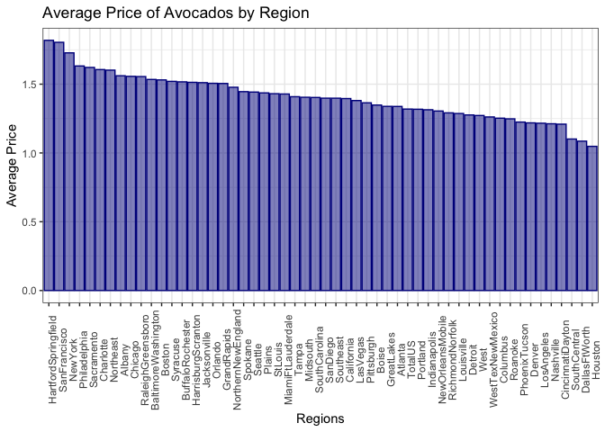
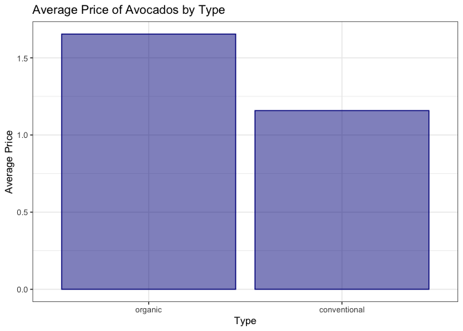
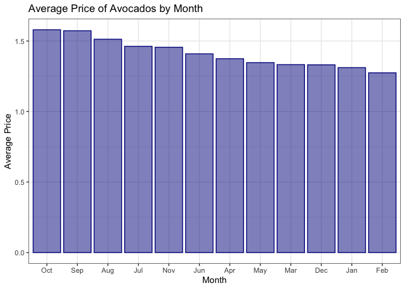
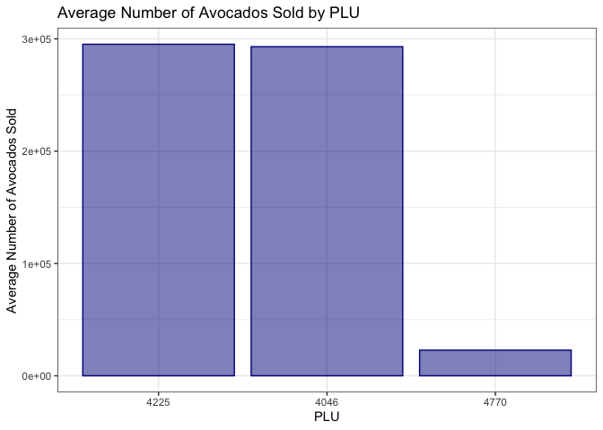
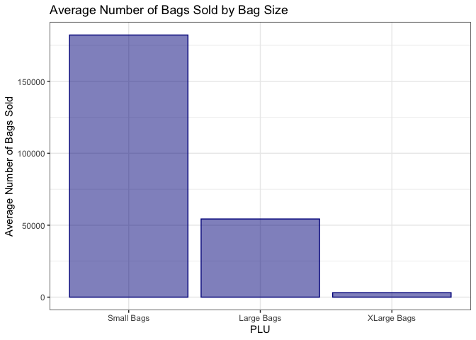
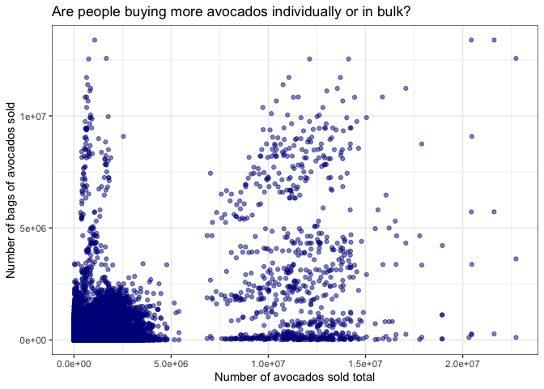
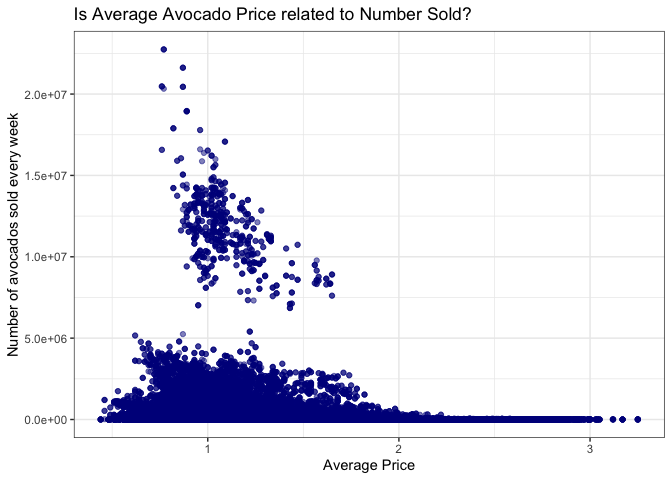
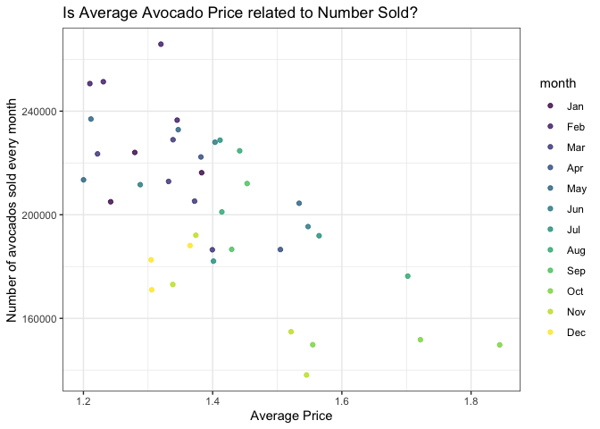
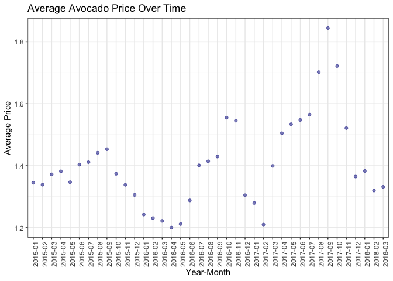

DSCI\_522\_EDA
================
Katie Birchard
17/01/2020

``` r
# Loading necessary packages for EDA
library(tidyverse)
```

    ## ── Attaching packages ─────────────────────────────────────────────────────────────────── tidyverse 1.3.0 ──

    ## ✓ ggplot2 3.2.1     ✓ purrr   0.3.3
    ## ✓ tibble  2.1.3     ✓ dplyr   0.8.3
    ## ✓ tidyr   1.0.0     ✓ stringr 1.4.0
    ## ✓ readr   1.3.1     ✓ forcats 0.4.0

    ## ── Conflicts ────────────────────────────────────────────────────────────────────── tidyverse_conflicts() ──
    ## x dplyr::filter() masks stats::filter()
    ## x dplyr::lag()    masks stats::lag()

``` r
library(lubridate)
```

    ## 
    ## Attaching package: 'lubridate'

    ## The following object is masked from 'package:base':
    ## 
    ##     date

``` r
library(caret)
```

    ## Loading required package: lattice

    ## 
    ## Attaching package: 'caret'

    ## The following object is masked from 'package:purrr':
    ## 
    ##     lift

``` r
# Loading in the dataset locally (will change to downloading using script later)
avocado <- read_csv("avocado.csv")
```

    ## Warning: Missing column names filled in: 'X1' [1]

    ## Parsed with column specification:
    ## cols(
    ##   X1 = col_double(),
    ##   Date = col_date(format = ""),
    ##   AveragePrice = col_double(),
    ##   `Total Volume` = col_double(),
    ##   `4046` = col_double(),
    ##   `4225` = col_double(),
    ##   `4770` = col_double(),
    ##   `Total Bags` = col_double(),
    ##   `Small Bags` = col_double(),
    ##   `Large Bags` = col_double(),
    ##   `XLarge Bags` = col_double(),
    ##   type = col_character(),
    ##   year = col_double(),
    ##   region = col_character()
    ## )

``` r
# Checking column headers
head(avocado)
```

    ## # A tibble: 6 x 14
    ##      X1 Date       AveragePrice `Total Volume` `4046` `4225` `4770` `Total Bags`
    ##   <dbl> <date>            <dbl>          <dbl>  <dbl>  <dbl>  <dbl>        <dbl>
    ## 1     0 2015-12-27         1.33         64237.  1037. 5.45e4   48.2        8697.
    ## 2     1 2015-12-20         1.35         54877.   674. 4.46e4   58.3        9506.
    ## 3     2 2015-12-13         0.93        118220.   795. 1.09e5  130.         8145.
    ## 4     3 2015-12-06         1.08         78992.  1132  7.20e4   72.6        5811.
    ## 5     4 2015-11-29         1.28         51040.   941. 4.38e4   75.8        6184.
    ## 6     5 2015-11-22         1.26         55980.  1184. 4.81e4   43.6        6684.
    ## # … with 6 more variables: `Small Bags` <dbl>, `Large Bags` <dbl>, `XLarge
    ## #   Bags` <dbl>, type <chr>, year <dbl>, region <chr>

``` r
# Changing the spread of the data so we have a column for PLU and bag size
# Note that PLU is the Price Look-Up codes - which are baed on the commodity,
# variety, and size of the avocado group
# It looks like the average price was calculated across these PLUs
avocado2 <- avocado %>% 
  gather(key = "PLU", value = "no_sold", `4046`, `4225`, `4770`) %>%
  gather(key = "bag_size", value = "bags_sold", `Small Bags`, `Large Bags`, `XLarge Bags`)

# Creating another column for month
avocado2$month <- month(as.Date(avocado2$Date), label=TRUE)

avocado2$year_month <- as.POSIXct(avocado2$Date)
avocado2$year_month <- format(avocado2$year_month, "%Y-%m")

# How many data points do we have for each feature?
length(avocado$X1)
```

    ## [1] 18249

``` r
length(avocado2$X1)
```

    ## [1] 164241

``` r
# Must split into test and train data, and only use train data for EDA
# set a random seed
set.seed(123)

# First, separate the dataset with average price as the target
trainIndex_price <- createDataPartition(avocado2$AveragePrice,
                                        p=0.8,
                                        list=FALSE,
                                        times=1)

priceTrain <- avocado2[trainIndex_price, ]
priceTest <- avocado2[-trainIndex_price, ]

# Second, separate the dataset with number sold as the target
trainIndex_sold <- createDataPartition(avocado2$no_sold,
                                        p=0.8,
                                        list=FALSE,
                                        times=1)

soldTrain <- avocado2[trainIndex_sold, ]
soldTest <- avocado2[-trainIndex_sold, ]
```

## What is the average avocado price per region?

``` r
avocado_by_region <- priceTrain %>%
  group_by(region) %>%
  summarize(ave_price = mean(AveragePrice))

# There are many regions here, so it might make sense to group them
ggplot(avocado_by_region, aes(x=reorder(region, -ave_price), y=ave_price)) +
  geom_col(fill="darkblue", alpha=0.5, colour="darkblue") +
  xlab("Regions") +
  ylab("Average Price") +
  ggtitle("Average Price of Avocados by Region") +
  theme_bw() +
  theme(axis.text.x = element_text(angle=90)) 
```

<!-- -->

## What is the average avocado price by type (organic vs. non-organic)

``` r
avocado_by_type <- priceTrain %>%
  group_by(type) %>%
  summarize(ave_price = mean(AveragePrice))

ggplot(avocado_by_type, aes(x=reorder(type, -ave_price), y=ave_price)) +
  geom_col(fill="darkblue", alpha=0.5, colour="darkblue") +
  xlab("Type") +
  ylab("Average Price") +
  ggtitle("Average Price of Avocados by Type") +
  theme_bw()
```

<!-- -->

## What is the average price per month?

``` r
avocado_by_month <- priceTrain %>%
  group_by(month) %>%
  summarize(ave_price = mean(AveragePrice))

# Interesting 
ggplot(avocado_by_month, aes(x=reorder(month, -ave_price), y=ave_price)) +
  geom_col(fill="darkblue", alpha=0.5, colour="darkblue") +
  xlab("Month") +
  ylab("Average Price") +
  ggtitle("Average Price of Avocados by Month") +
  theme_bw()
```

<!-- -->

## How many of each variety of avocado sells?

``` r
avocado_by_plu <- priceTrain %>%
  group_by(PLU) %>%
  summarize(ave_no_sold = mean(no_sold))

# PLU 4770 is not very popular...
ggplot(avocado_by_plu, aes(x=reorder(PLU, -ave_no_sold), y=ave_no_sold)) +
  geom_col(fill="darkblue", alpha=0.5, colour="darkblue") +
  xlab("PLU") +
  ylab("Average Number of Avocados Sold") +
  ggtitle("Average Number of Avocados Sold by PLU") +
  theme_bw()
```

<!-- -->

## Do people prefer buying smaller bags, or bigger bags of avocados?

``` r
avocado_by_bag <- priceTrain %>%
  group_by(bag_size) %>%
  summarize(ave_bags_sold = mean(bags_sold))

# Turns out smaller bags are better
ggplot(avocado_by_bag, aes(x=reorder(bag_size, -ave_bags_sold), y=ave_bags_sold)) +
  geom_col(fill="darkblue", alpha=0.5, colour="darkblue") +
  xlab("PLU") +
  ylab("Average Number of Bags Sold") +
  ggtitle("Average Number of Bags Sold by Bag Size") +
  theme_bw()
```

<!-- -->

## Do people buy their avocados in bags more or individually?

``` r
ggplot(priceTrain, aes(y=bags_sold, x=no_sold)) +
  geom_point(alpha=0.5, colour="darkblue") +
  ylab("Number of bags of avocados sold") +
  xlab("Number of avocados sold total") +
  ggtitle("Are people buying more avocados individually or in bulk?") +
  theme_bw()
```

<!-- -->

## Does average price correlate with how many avocados are sold per week?

``` r
ggplot(priceTrain, aes(x=AveragePrice, y=no_sold)) +
  geom_point(alpha=0.5, colour="darkblue") +
  xlab("Average Price") +
  ylab("Number of avocados sold every week") +
  ggtitle("Is Average Avocado Price related to Number Sold?") +
  theme_bw()
```

<!-- -->

## What about by month?

``` r
avocado_by_month2 <- priceTrain %>%
  group_by(year_month) %>%
  summarize(ave_no_sold = mean(no_sold),
            ave_price = mean(AveragePrice),
            month = first(month),
            region = first(region))

ggplot(avocado_by_month2, aes(x=ave_price, y=ave_no_sold, colour=month)) +
  geom_point(alpha=0.8) +
  xlab("Average Price") +
  ylab("Number of avocados sold every month") +
  ggtitle("Is Average Avocado Price related to Number Sold?") +
  theme_bw()
```

<!-- -->

``` r
ggplot(avocado_by_month2, aes(x=year_month, y=ave_price)) +
  geom_point(alpha=0.5, colour="darkblue") +
  xlab("Year-Month") +
  ylab("Average Price") +
  ggtitle("Average Avocado Price Over Time")
```

<!-- -->

``` r
  theme_bw() +
  theme(axis.text.x = element_text(angle=90)) 
```

    ## List of 65
    ##  $ line                      :List of 6
    ##   ..$ colour       : chr "black"
    ##   ..$ size         : num 0.5
    ##   ..$ linetype     : num 1
    ##   ..$ lineend      : chr "butt"
    ##   ..$ arrow        : logi FALSE
    ##   ..$ inherit.blank: logi TRUE
    ##   ..- attr(*, "class")= chr [1:2] "element_line" "element"
    ##  $ rect                      :List of 5
    ##   ..$ fill         : chr "white"
    ##   ..$ colour       : chr "black"
    ##   ..$ size         : num 0.5
    ##   ..$ linetype     : num 1
    ##   ..$ inherit.blank: logi TRUE
    ##   ..- attr(*, "class")= chr [1:2] "element_rect" "element"
    ##  $ text                      :List of 11
    ##   ..$ family       : chr ""
    ##   ..$ face         : chr "plain"
    ##   ..$ colour       : chr "black"
    ##   ..$ size         : num 11
    ##   ..$ hjust        : num 0.5
    ##   ..$ vjust        : num 0.5
    ##   ..$ angle        : num 0
    ##   ..$ lineheight   : num 0.9
    ##   ..$ margin       : 'margin' num [1:4] 0pt 0pt 0pt 0pt
    ##   .. ..- attr(*, "valid.unit")= int 8
    ##   .. ..- attr(*, "unit")= chr "pt"
    ##   ..$ debug        : logi FALSE
    ##   ..$ inherit.blank: logi TRUE
    ##   ..- attr(*, "class")= chr [1:2] "element_text" "element"
    ##  $ axis.title.x              :List of 11
    ##   ..$ family       : NULL
    ##   ..$ face         : NULL
    ##   ..$ colour       : NULL
    ##   ..$ size         : NULL
    ##   ..$ hjust        : NULL
    ##   ..$ vjust        : num 1
    ##   ..$ angle        : NULL
    ##   ..$ lineheight   : NULL
    ##   ..$ margin       : 'margin' num [1:4] 2.75pt 0pt 0pt 0pt
    ##   .. ..- attr(*, "valid.unit")= int 8
    ##   .. ..- attr(*, "unit")= chr "pt"
    ##   ..$ debug        : NULL
    ##   ..$ inherit.blank: logi TRUE
    ##   ..- attr(*, "class")= chr [1:2] "element_text" "element"
    ##  $ axis.title.x.top          :List of 11
    ##   ..$ family       : NULL
    ##   ..$ face         : NULL
    ##   ..$ colour       : NULL
    ##   ..$ size         : NULL
    ##   ..$ hjust        : NULL
    ##   ..$ vjust        : num 0
    ##   ..$ angle        : NULL
    ##   ..$ lineheight   : NULL
    ##   ..$ margin       : 'margin' num [1:4] 0pt 0pt 2.75pt 0pt
    ##   .. ..- attr(*, "valid.unit")= int 8
    ##   .. ..- attr(*, "unit")= chr "pt"
    ##   ..$ debug        : NULL
    ##   ..$ inherit.blank: logi TRUE
    ##   ..- attr(*, "class")= chr [1:2] "element_text" "element"
    ##  $ axis.title.y              :List of 11
    ##   ..$ family       : NULL
    ##   ..$ face         : NULL
    ##   ..$ colour       : NULL
    ##   ..$ size         : NULL
    ##   ..$ hjust        : NULL
    ##   ..$ vjust        : num 1
    ##   ..$ angle        : num 90
    ##   ..$ lineheight   : NULL
    ##   ..$ margin       : 'margin' num [1:4] 0pt 2.75pt 0pt 0pt
    ##   .. ..- attr(*, "valid.unit")= int 8
    ##   .. ..- attr(*, "unit")= chr "pt"
    ##   ..$ debug        : NULL
    ##   ..$ inherit.blank: logi TRUE
    ##   ..- attr(*, "class")= chr [1:2] "element_text" "element"
    ##  $ axis.title.y.right        :List of 11
    ##   ..$ family       : NULL
    ##   ..$ face         : NULL
    ##   ..$ colour       : NULL
    ##   ..$ size         : NULL
    ##   ..$ hjust        : NULL
    ##   ..$ vjust        : num 0
    ##   ..$ angle        : num -90
    ##   ..$ lineheight   : NULL
    ##   ..$ margin       : 'margin' num [1:4] 0pt 0pt 0pt 2.75pt
    ##   .. ..- attr(*, "valid.unit")= int 8
    ##   .. ..- attr(*, "unit")= chr "pt"
    ##   ..$ debug        : NULL
    ##   ..$ inherit.blank: logi TRUE
    ##   ..- attr(*, "class")= chr [1:2] "element_text" "element"
    ##  $ axis.text                 :List of 11
    ##   ..$ family       : NULL
    ##   ..$ face         : NULL
    ##   ..$ colour       : chr "grey30"
    ##   ..$ size         : 'rel' num 0.8
    ##   ..$ hjust        : NULL
    ##   ..$ vjust        : NULL
    ##   ..$ angle        : NULL
    ##   ..$ lineheight   : NULL
    ##   ..$ margin       : NULL
    ##   ..$ debug        : NULL
    ##   ..$ inherit.blank: logi TRUE
    ##   ..- attr(*, "class")= chr [1:2] "element_text" "element"
    ##  $ axis.text.x               :List of 11
    ##   ..$ family       : NULL
    ##   ..$ face         : NULL
    ##   ..$ colour       : NULL
    ##   ..$ size         : NULL
    ##   ..$ hjust        : NULL
    ##   ..$ vjust        : num 1
    ##   ..$ angle        : num 90
    ##   ..$ lineheight   : NULL
    ##   ..$ margin       : 'margin' num [1:4] 2.2pt 0pt 0pt 0pt
    ##   .. ..- attr(*, "valid.unit")= int 8
    ##   .. ..- attr(*, "unit")= chr "pt"
    ##   ..$ debug        : NULL
    ##   ..$ inherit.blank: logi FALSE
    ##   ..- attr(*, "class")= chr [1:2] "element_text" "element"
    ##  $ axis.text.x.top           :List of 11
    ##   ..$ family       : NULL
    ##   ..$ face         : NULL
    ##   ..$ colour       : NULL
    ##   ..$ size         : NULL
    ##   ..$ hjust        : NULL
    ##   ..$ vjust        : num 0
    ##   ..$ angle        : NULL
    ##   ..$ lineheight   : NULL
    ##   ..$ margin       : 'margin' num [1:4] 0pt 0pt 2.2pt 0pt
    ##   .. ..- attr(*, "valid.unit")= int 8
    ##   .. ..- attr(*, "unit")= chr "pt"
    ##   ..$ debug        : NULL
    ##   ..$ inherit.blank: logi TRUE
    ##   ..- attr(*, "class")= chr [1:2] "element_text" "element"
    ##  $ axis.text.y               :List of 11
    ##   ..$ family       : NULL
    ##   ..$ face         : NULL
    ##   ..$ colour       : NULL
    ##   ..$ size         : NULL
    ##   ..$ hjust        : num 1
    ##   ..$ vjust        : NULL
    ##   ..$ angle        : NULL
    ##   ..$ lineheight   : NULL
    ##   ..$ margin       : 'margin' num [1:4] 0pt 2.2pt 0pt 0pt
    ##   .. ..- attr(*, "valid.unit")= int 8
    ##   .. ..- attr(*, "unit")= chr "pt"
    ##   ..$ debug        : NULL
    ##   ..$ inherit.blank: logi TRUE
    ##   ..- attr(*, "class")= chr [1:2] "element_text" "element"
    ##  $ axis.text.y.right         :List of 11
    ##   ..$ family       : NULL
    ##   ..$ face         : NULL
    ##   ..$ colour       : NULL
    ##   ..$ size         : NULL
    ##   ..$ hjust        : num 0
    ##   ..$ vjust        : NULL
    ##   ..$ angle        : NULL
    ##   ..$ lineheight   : NULL
    ##   ..$ margin       : 'margin' num [1:4] 0pt 0pt 0pt 2.2pt
    ##   .. ..- attr(*, "valid.unit")= int 8
    ##   .. ..- attr(*, "unit")= chr "pt"
    ##   ..$ debug        : NULL
    ##   ..$ inherit.blank: logi TRUE
    ##   ..- attr(*, "class")= chr [1:2] "element_text" "element"
    ##  $ axis.ticks                :List of 6
    ##   ..$ colour       : chr "grey20"
    ##   ..$ size         : NULL
    ##   ..$ linetype     : NULL
    ##   ..$ lineend      : NULL
    ##   ..$ arrow        : logi FALSE
    ##   ..$ inherit.blank: logi TRUE
    ##   ..- attr(*, "class")= chr [1:2] "element_line" "element"
    ##  $ axis.ticks.length         : 'unit' num 2.75pt
    ##   ..- attr(*, "valid.unit")= int 8
    ##   ..- attr(*, "unit")= chr "pt"
    ##  $ axis.ticks.length.x       : NULL
    ##  $ axis.ticks.length.x.top   : NULL
    ##  $ axis.ticks.length.x.bottom: NULL
    ##  $ axis.ticks.length.y       : NULL
    ##  $ axis.ticks.length.y.left  : NULL
    ##  $ axis.ticks.length.y.right : NULL
    ##  $ axis.line                 : list()
    ##   ..- attr(*, "class")= chr [1:2] "element_blank" "element"
    ##  $ axis.line.x               : NULL
    ##  $ axis.line.y               : NULL
    ##  $ legend.background         :List of 5
    ##   ..$ fill         : NULL
    ##   ..$ colour       : logi NA
    ##   ..$ size         : NULL
    ##   ..$ linetype     : NULL
    ##   ..$ inherit.blank: logi TRUE
    ##   ..- attr(*, "class")= chr [1:2] "element_rect" "element"
    ##  $ legend.margin             : 'margin' num [1:4] 5.5pt 5.5pt 5.5pt 5.5pt
    ##   ..- attr(*, "valid.unit")= int 8
    ##   ..- attr(*, "unit")= chr "pt"
    ##  $ legend.spacing            : 'unit' num 11pt
    ##   ..- attr(*, "valid.unit")= int 8
    ##   ..- attr(*, "unit")= chr "pt"
    ##  $ legend.spacing.x          : NULL
    ##  $ legend.spacing.y          : NULL
    ##  $ legend.key                :List of 5
    ##   ..$ fill         : chr "white"
    ##   ..$ colour       : logi NA
    ##   ..$ size         : NULL
    ##   ..$ linetype     : NULL
    ##   ..$ inherit.blank: logi TRUE
    ##   ..- attr(*, "class")= chr [1:2] "element_rect" "element"
    ##  $ legend.key.size           : 'unit' num 1.2lines
    ##   ..- attr(*, "valid.unit")= int 3
    ##   ..- attr(*, "unit")= chr "lines"
    ##  $ legend.key.height         : NULL
    ##  $ legend.key.width          : NULL
    ##  $ legend.text               :List of 11
    ##   ..$ family       : NULL
    ##   ..$ face         : NULL
    ##   ..$ colour       : NULL
    ##   ..$ size         : 'rel' num 0.8
    ##   ..$ hjust        : NULL
    ##   ..$ vjust        : NULL
    ##   ..$ angle        : NULL
    ##   ..$ lineheight   : NULL
    ##   ..$ margin       : NULL
    ##   ..$ debug        : NULL
    ##   ..$ inherit.blank: logi TRUE
    ##   ..- attr(*, "class")= chr [1:2] "element_text" "element"
    ##  $ legend.text.align         : NULL
    ##  $ legend.title              :List of 11
    ##   ..$ family       : NULL
    ##   ..$ face         : NULL
    ##   ..$ colour       : NULL
    ##   ..$ size         : NULL
    ##   ..$ hjust        : num 0
    ##   ..$ vjust        : NULL
    ##   ..$ angle        : NULL
    ##   ..$ lineheight   : NULL
    ##   ..$ margin       : NULL
    ##   ..$ debug        : NULL
    ##   ..$ inherit.blank: logi TRUE
    ##   ..- attr(*, "class")= chr [1:2] "element_text" "element"
    ##  $ legend.title.align        : NULL
    ##  $ legend.position           : chr "right"
    ##  $ legend.direction          : NULL
    ##  $ legend.justification      : chr "center"
    ##  $ legend.box                : NULL
    ##  $ legend.box.margin         : 'margin' num [1:4] 0cm 0cm 0cm 0cm
    ##   ..- attr(*, "valid.unit")= int 1
    ##   ..- attr(*, "unit")= chr "cm"
    ##  $ legend.box.background     : list()
    ##   ..- attr(*, "class")= chr [1:2] "element_blank" "element"
    ##  $ legend.box.spacing        : 'unit' num 11pt
    ##   ..- attr(*, "valid.unit")= int 8
    ##   ..- attr(*, "unit")= chr "pt"
    ##  $ panel.background          :List of 5
    ##   ..$ fill         : chr "white"
    ##   ..$ colour       : logi NA
    ##   ..$ size         : NULL
    ##   ..$ linetype     : NULL
    ##   ..$ inherit.blank: logi TRUE
    ##   ..- attr(*, "class")= chr [1:2] "element_rect" "element"
    ##  $ panel.border              :List of 5
    ##   ..$ fill         : logi NA
    ##   ..$ colour       : chr "grey20"
    ##   ..$ size         : NULL
    ##   ..$ linetype     : NULL
    ##   ..$ inherit.blank: logi TRUE
    ##   ..- attr(*, "class")= chr [1:2] "element_rect" "element"
    ##  $ panel.spacing             : 'unit' num 5.5pt
    ##   ..- attr(*, "valid.unit")= int 8
    ##   ..- attr(*, "unit")= chr "pt"
    ##  $ panel.spacing.x           : NULL
    ##  $ panel.spacing.y           : NULL
    ##  $ panel.grid                :List of 6
    ##   ..$ colour       : chr "grey92"
    ##   ..$ size         : NULL
    ##   ..$ linetype     : NULL
    ##   ..$ lineend      : NULL
    ##   ..$ arrow        : logi FALSE
    ##   ..$ inherit.blank: logi TRUE
    ##   ..- attr(*, "class")= chr [1:2] "element_line" "element"
    ##  $ panel.grid.minor          :List of 6
    ##   ..$ colour       : NULL
    ##   ..$ size         : 'rel' num 0.5
    ##   ..$ linetype     : NULL
    ##   ..$ lineend      : NULL
    ##   ..$ arrow        : logi FALSE
    ##   ..$ inherit.blank: logi TRUE
    ##   ..- attr(*, "class")= chr [1:2] "element_line" "element"
    ##  $ panel.ontop               : logi FALSE
    ##  $ plot.background           :List of 5
    ##   ..$ fill         : NULL
    ##   ..$ colour       : chr "white"
    ##   ..$ size         : NULL
    ##   ..$ linetype     : NULL
    ##   ..$ inherit.blank: logi TRUE
    ##   ..- attr(*, "class")= chr [1:2] "element_rect" "element"
    ##  $ plot.title                :List of 11
    ##   ..$ family       : NULL
    ##   ..$ face         : NULL
    ##   ..$ colour       : NULL
    ##   ..$ size         : 'rel' num 1.2
    ##   ..$ hjust        : num 0
    ##   ..$ vjust        : num 1
    ##   ..$ angle        : NULL
    ##   ..$ lineheight   : NULL
    ##   ..$ margin       : 'margin' num [1:4] 0pt 0pt 5.5pt 0pt
    ##   .. ..- attr(*, "valid.unit")= int 8
    ##   .. ..- attr(*, "unit")= chr "pt"
    ##   ..$ debug        : NULL
    ##   ..$ inherit.blank: logi TRUE
    ##   ..- attr(*, "class")= chr [1:2] "element_text" "element"
    ##  $ plot.subtitle             :List of 11
    ##   ..$ family       : NULL
    ##   ..$ face         : NULL
    ##   ..$ colour       : NULL
    ##   ..$ size         : NULL
    ##   ..$ hjust        : num 0
    ##   ..$ vjust        : num 1
    ##   ..$ angle        : NULL
    ##   ..$ lineheight   : NULL
    ##   ..$ margin       : 'margin' num [1:4] 0pt 0pt 5.5pt 0pt
    ##   .. ..- attr(*, "valid.unit")= int 8
    ##   .. ..- attr(*, "unit")= chr "pt"
    ##   ..$ debug        : NULL
    ##   ..$ inherit.blank: logi TRUE
    ##   ..- attr(*, "class")= chr [1:2] "element_text" "element"
    ##  $ plot.caption              :List of 11
    ##   ..$ family       : NULL
    ##   ..$ face         : NULL
    ##   ..$ colour       : NULL
    ##   ..$ size         : 'rel' num 0.8
    ##   ..$ hjust        : num 1
    ##   ..$ vjust        : num 1
    ##   ..$ angle        : NULL
    ##   ..$ lineheight   : NULL
    ##   ..$ margin       : 'margin' num [1:4] 5.5pt 0pt 0pt 0pt
    ##   .. ..- attr(*, "valid.unit")= int 8
    ##   .. ..- attr(*, "unit")= chr "pt"
    ##   ..$ debug        : NULL
    ##   ..$ inherit.blank: logi TRUE
    ##   ..- attr(*, "class")= chr [1:2] "element_text" "element"
    ##  $ plot.tag                  :List of 11
    ##   ..$ family       : NULL
    ##   ..$ face         : NULL
    ##   ..$ colour       : NULL
    ##   ..$ size         : 'rel' num 1.2
    ##   ..$ hjust        : num 0.5
    ##   ..$ vjust        : num 0.5
    ##   ..$ angle        : NULL
    ##   ..$ lineheight   : NULL
    ##   ..$ margin       : NULL
    ##   ..$ debug        : NULL
    ##   ..$ inherit.blank: logi TRUE
    ##   ..- attr(*, "class")= chr [1:2] "element_text" "element"
    ##  $ plot.tag.position         : chr "topleft"
    ##  $ plot.margin               : 'margin' num [1:4] 5.5pt 5.5pt 5.5pt 5.5pt
    ##   ..- attr(*, "valid.unit")= int 8
    ##   ..- attr(*, "unit")= chr "pt"
    ##  $ strip.background          :List of 5
    ##   ..$ fill         : chr "grey85"
    ##   ..$ colour       : chr "grey20"
    ##   ..$ size         : NULL
    ##   ..$ linetype     : NULL
    ##   ..$ inherit.blank: logi TRUE
    ##   ..- attr(*, "class")= chr [1:2] "element_rect" "element"
    ##  $ strip.placement           : chr "inside"
    ##  $ strip.text                :List of 11
    ##   ..$ family       : NULL
    ##   ..$ face         : NULL
    ##   ..$ colour       : chr "grey10"
    ##   ..$ size         : 'rel' num 0.8
    ##   ..$ hjust        : NULL
    ##   ..$ vjust        : NULL
    ##   ..$ angle        : NULL
    ##   ..$ lineheight   : NULL
    ##   ..$ margin       : 'margin' num [1:4] 4.4pt 4.4pt 4.4pt 4.4pt
    ##   .. ..- attr(*, "valid.unit")= int 8
    ##   .. ..- attr(*, "unit")= chr "pt"
    ##   ..$ debug        : NULL
    ##   ..$ inherit.blank: logi TRUE
    ##   ..- attr(*, "class")= chr [1:2] "element_text" "element"
    ##  $ strip.text.x              : NULL
    ##  $ strip.text.y              :List of 11
    ##   ..$ family       : NULL
    ##   ..$ face         : NULL
    ##   ..$ colour       : NULL
    ##   ..$ size         : NULL
    ##   ..$ hjust        : NULL
    ##   ..$ vjust        : NULL
    ##   ..$ angle        : num -90
    ##   ..$ lineheight   : NULL
    ##   ..$ margin       : NULL
    ##   ..$ debug        : NULL
    ##   ..$ inherit.blank: logi TRUE
    ##   ..- attr(*, "class")= chr [1:2] "element_text" "element"
    ##  $ strip.switch.pad.grid     : 'unit' num 2.75pt
    ##   ..- attr(*, "valid.unit")= int 8
    ##   ..- attr(*, "unit")= chr "pt"
    ##  $ strip.switch.pad.wrap     : 'unit' num 2.75pt
    ##   ..- attr(*, "valid.unit")= int 8
    ##   ..- attr(*, "unit")= chr "pt"
    ##  - attr(*, "class")= chr [1:2] "theme" "gg"
    ##  - attr(*, "complete")= logi TRUE
    ##  - attr(*, "validate")= logi TRUE
