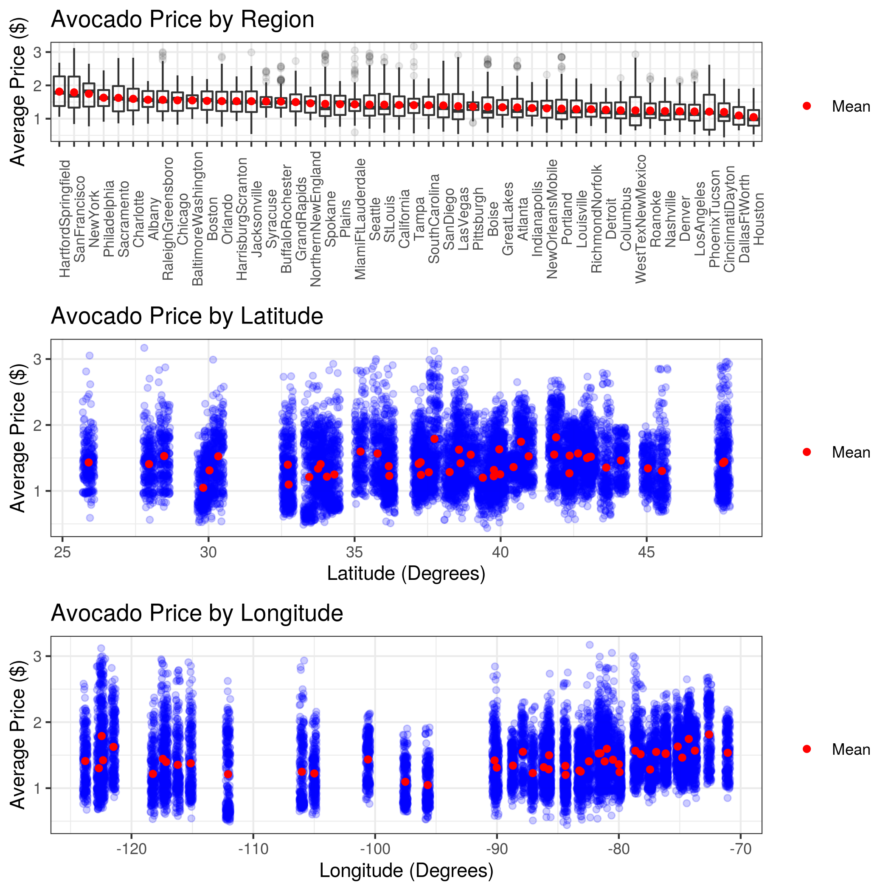
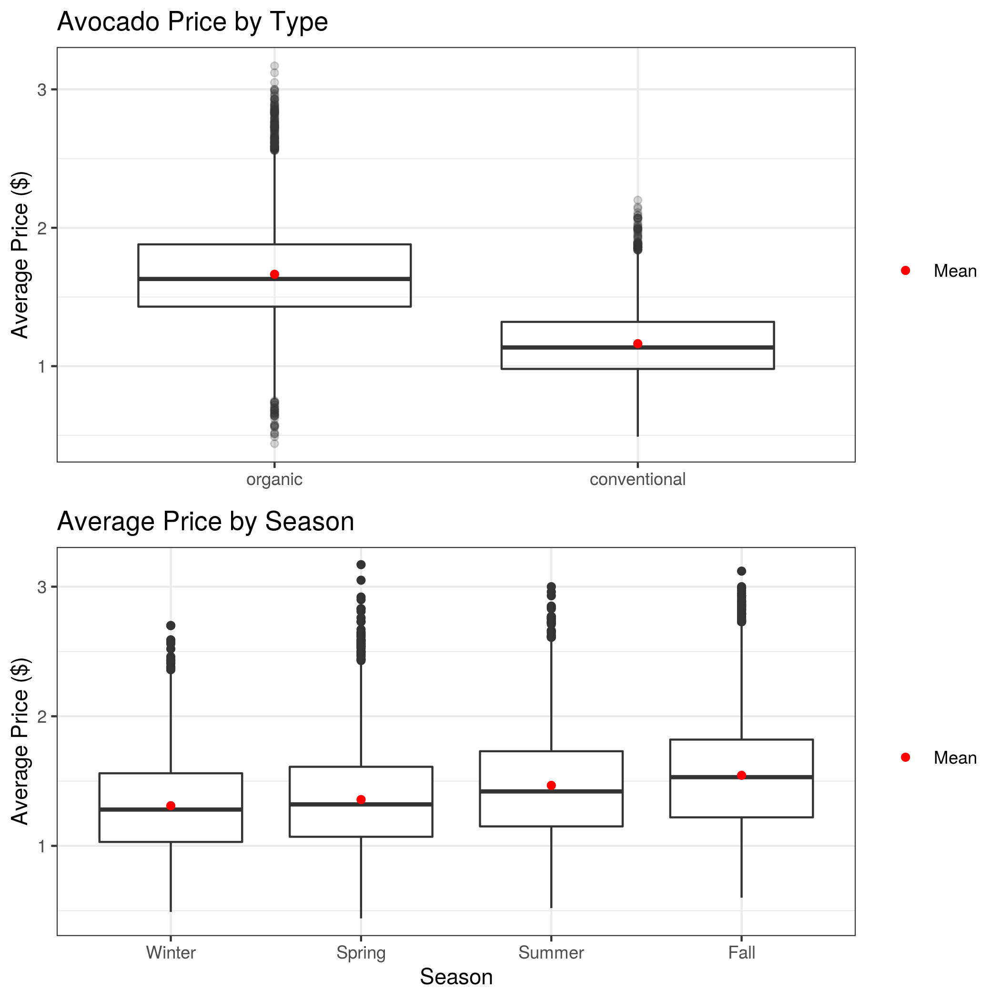

```{r setup, include=FALSE}
knitr::opts_chunk$set(echo = TRUE)
library(knitr)
library(tidyverse)
library(kableExtra)
```

# Introduction

As millenials, we love avocados. However, as we all know, avocados can be expensive. Therefore, we decided it would be interesting to investigate what drives avocado prices. We would like to know what time of year avocados are least expensive, and where avocados are the cheapest. Hopefully, the results of this investigation can give us insight on how to enjoy our beloved avocado toasts without breaking the bank.

We will be answering the research question: **What is the strongest predictor of avocado prices in the United States?** Thus, our goal is to find the feature that most strongly predicts the price of avocados in the United States. A natural inferential sub-question would be to first determine if any of the features correlate with avocado prices and if there is any multicollinearity among the features. From our results, we can also compute a rank of features by importance.

# Dataset

We analyzed the [avocado prices dataset](https://www.kaggle.com/neuromusic/avocado-prices) retrieved from Kaggle and compiled by the Hass Avocado Board using retail scan data from the United States [@avocado-data]. The dataset consists of approximately 18,000 records over 4 years (2015 - 2018). The dataset contains information about avocado prices, Price Look-Up (PLU) codes, types (organic or conventional), region purchased in the United States, volume sold, bags sold, and date sold.

# Analysis

We used a random forest regression model to determine the strongest predictors of avocado prices. Before we fitted the model, we first conducted a hypothesis test and a multicollinearity test to determine which features are significant and should be used in the model. These tests also identified features that are strongly correlated with one another, and therefore would be redundant to include in the model.

The features we tested were:

- `total_volume`: total volume of avocados sold
- `PLU_4046`: number of of avocados with a price lookup code of 4046 (small avocado) sold
- `PLU_4225`: number of of avocados with a price lookup code of 4225 (large avocado) sold
- `PLU_4770`:  number of of avocados with a price lookup code of 4770 (x-large avocado) sold
- `total_bags`: total number of bags of avocados sold
- `small_bags`: number of small bags of avocados sold
- `large_bags`: number of large bags of avocados sold
- `xlarge_bags`: number of x-large bags of avocados sold
- `type`: type of avocado sold (conventional or organic)
- `year`: year avocado was sold in
- `lat`: latitude of the U.S. region the avocado was sold in
- `lon`: longitude of the U.S. region the avocado was sold in
- `season`: season avocado was sold in

The features we used to train the random forest regression model on were:

- `type`: type of avocado sold (conventional or organic)
- `lat`: latitude of the U.S. region the avocado was sold in
- `lon`: longitude of the U.S. region the avocado was sold in
- `season`: season avocado was sold in
- *The intuition behind training on these selected features will be explained later on in the report.*

The target was:

- `average_price`: average price of avocado sold

# Exploratory Data Analysis

We wanted to determine which features might be the most important to include in our random forest regression model. Therefore we plotted region, latitude, longitude, type, and season against the average price to visualize the relationships between these variables (figure 1). We did not plot number of avocados sold from each of the PLU codes, `PLU_4046`, `PLU_4225`, and `PLU_4770`, or the number of bags sold from `total_bags`, `small_bags`, `large_bags`, and `xlarge_bags`, because the relationship between avocado prices and avocados sold could be reciprocal (i.e. avocados sold may influence the price and vice versa), leading to a false interpretation. From looking at these relationships, we can see that some regions, such as Hartford-Springfield and San Francisco, have higher avocado prices than other regions, such as Houston. When looking at latitude and longitude, it looks like latitude has no observable trend with average price, but longitude may have a slight parabolic trend with average price. We can also clearly see (and we may have already predicted from our own experience) that organic avocados tend to be more expensive than non-organic avocados. Finally, when we observe the seasonal trend of avocado prices, we can see that perhaps avocados are most expensive in the fall months, and least expensive during the winter months.



**Figure 1.** Average price of avocados in the United States by region, latitude, longitude, type, and season.

Since we want to ensure the prices in this dataset are relatively accurate, we compared the average prices in this dataset to another [study](https://www.statista.com/statistics/493487/average-sales-price-of-avocados-in-the-us/) published by M. Shahbandeh in February 2019. According to the dataset we selected, the average price of avocados from 2015 to 2018 was \$1.41. According to Shahbandeh’s study, the average price of avocados from 2015 to 2018 was \$1.11 [@avocado-study]. Thus, the average price from our dataset is slightly higher compared to Shahbandeh’s study. This discrepancy could be due to the inclusion of organic avocados in this dataset, which tend to be more expensive. However, the prices are still similar enough that the observations from this dataset are likely accurate.

## Hypothesis Test

Before undergoing our main analysis, we first conducted a hypothesis test to determine if any of the features are correlated with the target. To conduct a hypothesis test, we fitted an additive linear model and interpreted the p-values to determine which features are significant. We chose a significance level of 0.05 as it is the industry standard. We chose not to choose a stricter significance level (i.e. 0.01 or 0.001) as we do not believe that predicting avocado prices requires as conservative of a test.

Based on our EDA, we chose to fit a linear model to conduct our hypothesis test. To confirm that a linear model would be appropriate for this dataset, we examined its residual plot. Looking at the residual plot below, the points are randomly distributed which indicates that a linear model is appropriate in this case.

<div style="text-align: center">
  
  <div>**Figure 2.** Residual plot to examine appropriateness of using a linear model.</div>
</div>

At a significance level of 0.05, it appears from the model below that the following features are significant as their p-values are less than the significance level:

- `type`
- `year`
- `lat`
- `lon`
- `season`
- `total_volume`
- `PLU_4046`
- `PLU_4225`
- `PLU_4770`

```{r, echo = FALSE, message=FALSE, warning=FALSE}
p_val <- read_csv("img/hypothesis_test_table.csv") %>% 
  mutate(p.value = as.character(signif(p.value, 3)))
kable(p_val,
      caption = "**Table 1**. Hypothesis Test Table.")
```

However, we should be cautious not to use the p-value significance as a stand alone measure to determine if these features are correlated with the target.

## Multicollinearity Test

Next, we conducted a multicollinearity test to check for any redundancies between features. Under the assumption that the data can be modelled linearly after observing the residual plot, we selected the continuous numerical predictors, computed the correlation matrix, and wrangled the data into a plottable dataframe [@corr].

<div style="text-align: center">
  
  <div>**Figure 3.** Correlation matrix of continuous features.</div>
</div>

Overall, there is fairly high collinearity between many of the predictors. This was expected, since they all deal with volume or number of avocados sold, be it by PLU code, bag type or total volume. In particular, `total_bags` and `total_volume` were expected to be highly correlated with other predictors that were sub-quantities of these totals. Due to the high correlation, including all these predictors in a prediction model would probably lead to overfitting.

To verify the result from the correlation matrix above, we also computed the variance inflation (VIF) scores from the `car` package.

```{r, echo = FALSE, message=FALSE, warning=FALSE}
col <- read_csv("img/collinearity.csv")
kable(col,
      caption = "**Table 2.** Variance inflation scores of continuous features.") %>%
  kable_styling(latex_options="scale_down")
```

The high VIF scores suggest extremely high collinearity for these variables in a linear model. Therefore, we will be careful about using these features as they are probably ineffective predictors of the average avocado price.

# Results

## Random Forest

We fitted a random forest regressor model using the significant features from the analysis above (`lat`, `lon`, `type`, and `season`). We used one hot encoding to scale the categorical features (`type` and `season`) and standard scaling tto scale the numerical features(`lat` and `lon`). We used randomized cross validation to determine the optimal values for maximum depth and number of estimators. We calculated the average (validation) scores using cross validation to determine how well our model was performing.

```{r, echo = FALSE, message=FALSE, warning=FALSE}
cv_scores <- read_csv("../results/cv_scores_rfr.csv")

cv_scores <- cv_scores %>%
  select(`Fold`, `Neg Mean Squared Error`)

kable(cv_scores,
      caption="**Table 3**. Cross-validation scores for each of the folds in the random forest regression model.")

print(paste0("The average cross-validation score for random forest regression is: ", round(abs(mean(cv_scores$`Neg Mean Squared Error`)), 3)))
```

From this model, we identified the relative importance of each feature.

```{r, echo = FALSE, message=FALSE, warning=FALSE}
feat_imp <- read_csv("../results/feature_importance_rfr.csv")
feat_imp <- feat_imp %>%
  select(`Feature Names` = `feature_names`,
         `Importance` = `importance`)
#feat_imp <- feat_imp[1:15, ]
kable(feat_imp,
      caption="**Table 4**. The relative feature importances determined by random forest regression model.")
```

According to the random forest regression, the top predictor of avocado prices is `type` (i.e. whether the avocado is organic or conventional). This result aligned with our expectations, as our EDA depicted differences in distributions between organic and conventional avocado prices.

## Linear Regression

To compare, we fitted a linear regression model using L2 regularization. We also used randomized cross validation to determine the optimal value for the complexity penalization factor, alpha. Again, we calculated the average (validation) scores using cross validation to determine how well our model was performing.

```{r, echo = FALSE, message=FALSE, warning=FALSE}
cv_scores <- read_csv("../results/cv_scores_lr.csv")

cv_scores <- cv_scores %>%
  select(`Fold`, `Neg Mean Squared Error`)

kable(cv_scores,
      caption="**Table 5**. Cross-validation scores for each of the folds in the linear regression model.")

print(paste0("The average cross-validation score for linear regression is: ", round(abs(mean(cv_scores$`Neg Mean Squared Error`)), 3)))
```

The linear regression model had even lower error than the random forest regression model. This may indicate that linear regression may be a better model for predicting average avocado prices.

From the linear regression model, we also identified the relative weights of each of the coefficients. 

```{r, echo = FALSE, message=FALSE, warning=FALSE}
feat_imp <- read_csv("../results/feature_weights_lr.csv")
feat_imp <- feat_imp %>%
  select(`Feature Names` = `feature_names`,
         `Weights` = `weights`)
#feat_imp <- feat_imp[1:15, ]
kable(feat_imp,
      caption="**Table 6**. The relative feature weights determined by the linear regression model.")
```

When looking at the relative feature weights from the linear regression model, we need to account for the absolute weight. Therefore, comparing the two models, random forest regression and linear regression, we can see that both indicated `type` as the most important predictor of avocado pricing (figure 4).


**Figure 4.** Relative feature importances for random forest regression, and feature weights for linear regression.

# Discussion

## Conclusion

The random forest regression model predicted that `type` is the most important feature for predicting avocado price. This result is expected, since we observed a significant difference in the distribution of average prices between organic and conventional avocados during the exploratory data analysis and hypothesis testing. We also expected this result from previous experience buying avocados. Organic avocados are grown without the use of pesticides, and therefore produce a lower yield per growing season, ultimately resulting in a more expensive avocado.

The `region` feature also seemed to play some importance in the pricing of avocados. For instance, regions such as Hartford-Springfield and San Francisco were the third and fourth most important predictors of average avocado price. It is unclear how these regions affect avocado prices. A possible explanation could be that some regions, such as San Francisco, have significantly higher priced avocados because of the fact that the cost of living in these regions significantly higher than other regions in the United States. On the other hand, other regions, such as Texas, have significantly lower priced avocados because avocados are grown these regions.

## Areas of Improvement

Our model could be improved by the inclusion of even more predictive features or more data. Although it seems the predictors we did have worked quite well, we could possibly gain even more insight from predictors such as weather, grocery store chain, and popularity in the media or public perception. In addition, the data that we do have only spans four years. If we have data from a longer time span (e.g. 50 years), we might be able to more effectively determine the accuracy of our chosen predictors.

We could also use more feature selection techniques to support the conclusions that we made from our random forest and linear regression models. Using techniques such as forward selection or recursive feature selection may allow us to make stronger conclusions about which features really do predict avocado prices.

# R and Python Packages 

To perform this analysis, we used the R and Python programming languages [@r; @Python]. As well, the following R packages were used: `broom` [@broom], `caret` [@caret], `car` [@car], `docopt` [@docopt], `feather` [@feather], `ggpubr` [@ggpubr], `here`[@here], `kableExtra` [@kableExtra], `knitr` [@knitr], `lubridate` [@lubridate], `magick`[@magick], `RCurl` [@RCurl], `reshape2` [@reshape2], and `tidyverse` [@tidyverse]. The following Python packages were used: `altair` [@2018-altair], `numpy` [@numpy], `pandas` [@pandas], `pyarrow`[@pyarrow], `scikit-learn` [@scikit-learn], and `selenium` [@selenium]. And the following OS package was used: `chromedriver`[@chromedriver].

# References
