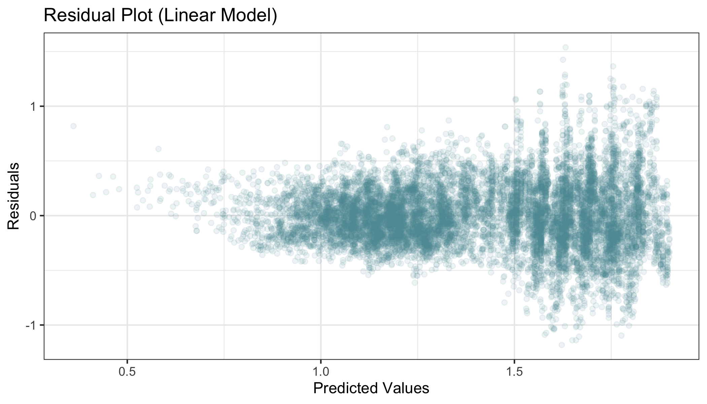

```{r setup, include=FALSE}
knitr::opts_chunk$set(echo = TRUE)
library(knitr)
library(tidyverse)
library(kableExtra)
```

# What is the strongest predictor of avocado prices in the United States?

We will be answering the research question: **What is the strongest predictor of avocado prices in the United States?**

As millenials, we love avocados but, as we all know, avocados can be expensive. Therefore, we decided it would be interesting to investigate what drives avocado prices. Hopefully, the results of this investigation can give us insight on how to enjoy our beloved avocado toasts without breaking the bank.

Our goal is to find the feature that most strongly predicts the price of avocados in the United States. A natural inferential sub-question would be to first determine if any of the features correlate with avocado prices and if there is any multicollinearity among the features. From our results, we can also compute a rank of features by importance.

# Dataset

We will be analyzing the [avocado prices dataset](https://www.kaggle.com/neuromusic/avocado-prices) retrieved from Kaggle and compiled by the Hass Avocado Board using retail scan data from the United States [@avocado-data]. The dataset consists of approximately 18,000 records over 4 years (2015 - 2018). The dataset contains information about avocado prices, Price Look-Up (PLU) codes, types (organic or conventional), region purchased in the United States, volume sold, bags sold, and date sold.

# Analysis

We used a random forest regression model to determine the strongest predictors of avocado prices. Before we fitted the model, we first conducted a hypothesis test and a multicollinearity test to determine which features are significant and should be used in the model. These tests also identified features that were strongly correlated with one another, and therefore would be redundant to include in the model.

The features we tested were:

- `total_volume`: total volume of avocados sold
- `PLU_4046`: number of of avocados with a price lookup code of 4046 (small avocado) sold
- `PLU_4225`: number of of avocados with a price lookup code of 4225 (large avocado) sold
- `PLU_4770`:  number of of avocados with a price lookup code of 4770 (x-large avocado) sold
- `total_bags`: total number of bags of avocados sold
- `small_bags`: number of small bags of avocados sold
- `large_bags`: number of large bags of avocados sold
- `xlarge_bags`: number of x-large bags of avocados sold
- `type`: type of avocado sold (conventional or organic)
- `year`: year avocado was sold in
- `lat`: latitude of the U.S. region the avocado was sold in
- `lon`: longitude of the U.S. region the avocado was sold in
- `season`: season avocado was sold in

The features we used in the random forest regression model were:

- `type`: type of avocado sold (conventional or organic)
- `lat`: latitude of the U.S. region the avocado was sold in
- `lon`: longitude of the U.S. region the avocado was sold in
- `season`: season avocado was sold in
- *The intuition behind these selected features will be explained later on in the report.*

The target was:
  
- `average_price`: average price of avocado sold

To perform this anlaysis, the R and Python programming languages [@r; @Python]. As well, the following R packages were used: `broom` [@broom], `caret` [@caret], `car` [@car], `docopt` [@docopt], `feather` [@feather], `ggpubr` [@ggpubr], `here`[@here], `kableExtra` [@kableExtra], `knitr` [@knitr], `lubridate` [@lubridate], `magick`[@magick], `RCurl` [@RCurl], `reshape2` [@reshape2], and `tidyverse` [@tidyverse]. The following Python packages were used: `altair` [@2018-altair], `numpy` [@numpy], `pandas` [@pandas], `pyarrow`[@pyarrow], `scikit-learn` [@scikit-learn], and `selenium` [@selenium]. And the following OS package was used: `chromedriver`[@chromedriver].

# Exploratory Data Analysis

We wanted to determine which features might be the most important to include in our random forest regression model. Therefore we plotted region, type, and month against the average price to visualize the relationships between these variables. We did not plot number of avocados sold from each of the PLU codes, `PLU_4046`, `PLU_4225`, and `PLU_4770`, or the number of bags sold from `total_bags`, `small_bags`, `large_bags`, and `xlarge_bags`, because the relationship between avocado prices and avocados sold could be reciprocal (i.e. avocados sold may influence the price and vice versa), leading to a false interpretation. From looking at these relationships, we can see that some regions, such as Hartford-Springfield and San Francisco, have higher avocado prices than other regions, such as Houston. We can also clearly see (and we may have already predicted from our own experience) that organic avocados are likely more expensive than non-organic avocados. Finally, when we observe the monthly trend of avocado prices, we can see that perhaps avocados are most expensive in the fall months, and least expensive during the winter months.


**Figure 1.** Average price of avocados in the United States by region, type, month, and number of total avocados sold each week.

Since we want to ensure the prices in this dataset are relatively accurate, we compared the average prices in this dataset to another [study](https://www.statista.com/statistics/493487/average-sales-price-of-avocados-in-the-us/) published by M. Shahbandeh in February 2019. According to the dataset we selected, the average price of avocados from 2015 to 2018 was \$1.41. According to Shahbandeh’s study, the average price of avocados from 2015 to 2018 was \$1.11 [@avocado-study]. Thus, the average price from our dataset is slightly higher compared to Shahbandeh’s study. This discrepancy could be due to the inclusion of organic avocados in this dataset, which tend to be more expensive. However, the prices are still similar enough that the observations from this dataset are likely accurate.

## Hypothesis Test

Before undergoing our main analysis, we first conducted a hypothesis test to determine if any of the features are correlated to the target. To conduct a hypothesis test, we fitted an additive linear model and interpreted the p-values to determine which features are significant. We chose a significance level of 0.05 as it is the industry standard. We chose not to choose a stricter significance level (i.e. 0.01 or 0.001) as we do not believe that predicting avocado prices requires as conservative of a test. 

Based on our EDA, we chose to fit a linear model to conduct our hypothesis test. To confirm that a linear model would be appropriate for this dataset, we examined its residual plot. Looking at the residual plot below, the points are randomly distributed which indicates that a linear model is appropriate in this case.

**Figure 2.** Residual plot to examine appropriateness of using a linear model.

At a significance level of 0.05, it appears from the model below that the following features are significant as their p-values are less than the significance level:

- `type`
- `year`
- `lat`
- `lon`
- `season`
- `total_volume`
- `PLU_4046`
- `PLU_4225`
- `PLU_4770`

```{r, echo = FALSE, message=FALSE, warning=FALSE}
p_val <- read_csv("img/hypothesis_test_table.csv")
kable(p_val,
      caption = "**Table 1**. Hypothesis Test Table.")
```

However, we should be cautious not to use the p-value significance as a stand alone measure to determine if these features are correlated with the target.

## Multicollinearity Test

Next, we conducted a multicollinearity test to check for any redundancies between features. Under the assumption that the data can be modelled linearly after observing the residual plot, we selected the continuous numerical predictors, computed the correlation matrix, and wrangled the data into a plottable dataframe [@corr].

**Figure 3.** Correlation matrix of continuous features.

Overall, there is fairly high collinearity between many of the predictors. This was expected, since they all deal with volume or number of avocados sold, be it by PLU code, bag type or total volume. In particular, `total_bags` and `total_volume` were expected to be highly correlated to other predictors that were sub-quantities of these totals. Due to the high correlation, including all these predictors in a prediction model would probably lead to overfitting.

To verify the result from the correlation matrix above, we also computed the variance inflation (VIF) scores from the `car` package.

```{r, echo = FALSE, message=FALSE, warning=FALSE}
col <- read_csv("img/collinearity.csv")
kable(col,
      caption = "**Table 2.** Variance inflation scores of continuous features.") %>% 
  kable_styling(latex_options="scale_down")
```

The high VIF scores suggest extremely high collinearity for these variables in a linear model. Therefore, we will be careful about using these features as they are probably ineffective predictors of the average avocado price.

# Results

## Random Forest Feature Importances

Lastly, we fitted a random forest regressor model using the features that we determined as significant from the analysis above (`region`, `type`, and `month`). We used one hot encoding on these categorical features and used randomized cross validation to determine the optimal hyperparameters, maximum depth and number of estimators. We calculated the average (validation) scores using cross validation to determine how well our model was performing.

```{r, echo = FALSE, message=FALSE, warning=FALSE}
cv_scores <- read_csv("../results/cv_scores.csv")
cv_scores <- cv_scores %>%
  select(`Fold`, `Neg Mean Squared Error`)
kable(cv_scores,
      caption="**Table 3**. Cross-validation scores for each of the folds in the random forest regression model.")
```

From this model, we were able to determine the relative importance of each feature.

```{r, echo = FALSE, message=FALSE, warning=FALSE}
feat_imp <- read_csv("../results/feature_importance.csv")
feat_imp <- feat_imp %>%
  select(`Feature Names` = `feature_names`,
         `Importance` = `importance`)
feat_imp <- feat_imp[1:15, ]
kable(feat_imp,
      caption="**Table 4**. The relative feature importances of the top 15 most important features determined by random forest regression model.")
```

We found that our top predictor of avocado prices is `type` (i.e. whether the avocado is organic or conventional).


**Figure 4.** Plot ranking features by importance.

Our model had a training accuracy score of 0.71. The result from our model aligned with our expectations as our EDA depicted differences in distributions between organic and conventional acovado prices.

We also fitted a linear regression model, however, the training accuracy score was 0.61, which is much lower than the accuracy of the random forest model. Therefore, we decided to use the random forest model to continue on with our analysis of computing feature importances.

# Discussion

## Conclusion

The random forest regression model predicted that `type` is the most important feature for predicting avocado price. This result is expected, since we observed a significant difference in the distribution of average prices between organic and conventional avocados during the exploratory data analysis and hypothesis testing. We also expected this result from previous experience buying avocados. Organic avocados are grown without the use of pesticides, and therefore produce a lower yield per growing season, ultimately resulting in a more expensive avocado.

The `region` feature also seemed to play some importance in the pricing of avocados. For instance, regions such as Hartford-Springfield and San Francisco were the third and fourth most important predictors of average avocado price. It is unclear how these regions affect avocado prices. A possible explanation could be that some regions, such as San Francisco, have significantly higher priced avocados because of the fact that the cost of living in these regions significantly higher than other regions in the United States. On the other hand, other regions, such as Texas, have significantly lower priced avocados because avocados are grown these regions.

## Areas of Improvement

Our random forest model could be improved substantially by modifying the `month` and `region` features.  

`Month` is ordinal, thus it should be treated as a numerical variable. However, it is difficult to convert month into its numerical form since December and January would be interpreted as furthest apart from one another, when in reality they should be interpreted as close to one another. That being said, we could treat month as a categorical variable if we group the months into seasons and use season as a feature instead. 

Similarly, the different regions within the `region` feature are also related to one other as some regions are closer to one another geographically, while others are further apart. Therefore, a more accurate way to depict `region` would be to transform each region into its respective latitude and longitude.

# References
