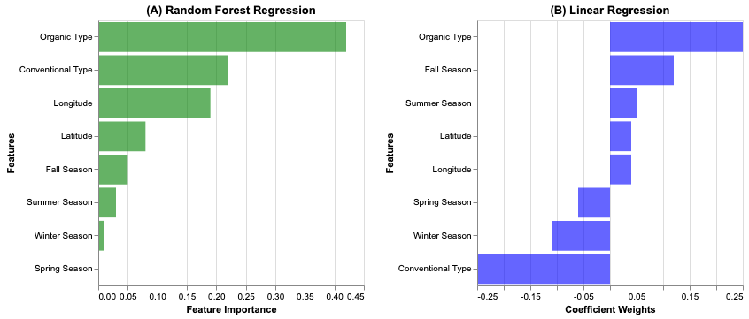

DSCI 522 Avocado Predictors
================
Katie Birchard, Ryan Homer, Andrea Lee
24/01/2020

# What is the strongest predictor of avocado prices in the United States?

We will be answering the research question: **What is the strongest
predictor of avocado prices in the United States?**

As millenials, we love avocados but, as we all know, avocados can be
expensive. Therefore, we decided it would be interesting to investigate
what drives avocado prices. Hopefully, the results of this investigation
can give us insight on how to enjoy our beloved avocado toasts without
breaking the bank.

Our goal is to find the feature that most strongly predicts the price of
avocados in the United States. A natural inferential sub-question would
be to first determine if any of the features correlate with avocado
prices and if there is any multicollinearity among the features. From
our results, we can also compute a rank of features by importance.

# Dataset

We will be analyzing the [avocado prices
dataset](https://www.kaggle.com/neuromusic/avocado-prices) retrieved
from Kaggle and compiled by the Hass Avocado Board using retail scan
data from the United States (Kiggins 2018). The dataset consists of
approximately 18,000 records over 4 years (2015 - 2018). The dataset
contains information about avocado prices, Price Look-Up (PLU) codes,
types (organic or conventional), region purchased in the United States,
volume sold, bags sold, and date sold.

# Analysis

We used a random forest regression model to determine the strongest
predictors of avocado prices. Before we fitted the model, we first
conducted a hypothesis test and a multicollinearity test to determine
which features are significant and should be used in the model. These
tests also identified features that were strongly correlated with one
another, and therefore would be redundant to include in the model.

The features we tested were:

  - `total_volume`: total volume of avocados sold
  - `PLU_4046`: number of of avocados with a price lookup code of 4046
    (small avocado) sold
  - `PLU_4225`: number of of avocados with a price lookup code of 4225
    (large avocado) sold
  - `PLU_4770`: number of of avocados with a price lookup code of 4770
    (x-large avocado) sold
  - `total_bags`: total number of bags of avocados sold
  - `small_bags`: number of small bags of avocados sold
  - `large_bags`: number of large bags of avocados sold
  - `xlarge_bags`: number of x-large bags of avocados sold
  - `type`: type of avocado sold (conventional or organic)
  - `year`: year avocado was sold in
  - `lat`: latitude of the U.S. region the avocado was sold in
  - `lon`: longitude of the U.S. region the avocado was sold in
  - `season`: season avocado was sold in

The features we used in the random forest regression model were:

  - `type`: type of avocado sold (conventional or organic)
  - `lat`: latitude of the U.S. region the avocado was sold in
  - `lon`: longitude of the U.S. region the avocado was sold in
  - `season`: season avocado was sold in
  - *The intuition behind these selected features will be explained
    later on in the report.*

The target was:

  - `average_price`: average price of avocado sold

To perform this anlaysis, the R and Python programming languages (R Core
Team 2019; Van Rossum and Drake 2009). As well, the following R packages
were used: `broom` (Robinson and Hayes 2019), `caret` (Kuhn 2020), `car`
(Fox and Weisberg 2019), `docopt` (de Jonge 2018), `feather` (Wickham
2019), `ggpubr` (Kassambara 2018), `here`(Müller 2017), `kableExtra`
(Zhu 2019), `knitr` (Xie 2014), `lubridate` (Grolemund and Wickham
2011), `magick`(Ooms 2020), `RCurl` (Temple Lang 2020), `reshape2`
(Wickham 2007), and `tidyverse` (Wickham et al. 2019). The following
Python packages were used: `altair` (Sievert 2018), `numpy` (Oliphant
2006), `pandas` (McKinney and others 2010), `pyarrow`(Team 2017),
`scikit-learn` (Pedregosa et al. 2011), and `selenium` (Salunke 2014).
And the following OS package was used: `chromedriver`(Google, n.d.).

# Exploratory Data Analysis

We wanted to determine which features might be the most important to
include in our random forest regression model. Therefore we plotted
region, type, and month against the average price to visualize the
relationships between these variables. We did not plot number of
avocados sold from each of the PLU codes, `PLU_4046`, `PLU_4225`, and
`PLU_4770`, or the number of bags sold from `total_bags`, `small_bags`,
`large_bags`, and `xlarge_bags`, because the relationship between
avocado prices and avocados sold could be reciprocal (i.e. avocados sold
may influence the price and vice versa), leading to a false
interpretation. From looking at these relationships, we can see that
some regions, such as Hartford-Springfield and San Francisco, have
higher avocado prices than other regions, such as Houston. We can also
clearly see (and we may have already predicted from our own experience)
that organic avocados are likely more expensive than non-organic
avocados. Finally, when we observe the monthly trend of avocado prices,
we can see that perhaps avocados are most expensive in the fall months,
and least expensive during the winter months.

 **Figure 1.** Average price of avocados in
the United States by region, type, month, and number of total avocados
sold each week.

Since we want to ensure the prices in this dataset are relatively
accurate, we compared the average prices in this dataset to another
[study](https://www.statista.com/statistics/493487/average-sales-price-of-avocados-in-the-us/)
published by M. Shahbandeh in February 2019. According to the dataset we
selected, the average price of avocados from 2015 to 2018 was $1.41.
According to Shahbandeh’s study, the average price of avocados from 2015
to 2018 was $1.11 (Shahbandeh 2019). Thus, the average price from our
dataset is slightly higher compared to Shahbandeh’s study. This
discrepancy could be due to the inclusion of organic avocados in this
dataset, which tend to be more expensive. However, the prices are still
similar enough that the observations from this dataset are likely
accurate.

## Hypothesis Test

Before undergoing our main analysis, we first conducted a hypothesis
test to determine if any of the features are correlated to the target.
To conduct a hypothesis test, we fitted an additive linear model and
interpreted the p-values to determine which features are significant. We
chose a significance level of 0.05 as it is the industry standard. We
chose not to choose a stricter significance level (i.e. 0.01 or 0.001)
as we do not believe that predicting avocado prices requires as
conservative of a test.

Based on our EDA, we chose to fit a linear model to conduct our
hypothesis test. To confirm that a linear model would be appropriate for
this dataset, we examined its residual plot. Looking at the residual
plot below, the points are randomly distributed which indicates that a
linear model is appropriate in this case.
 **Figure 2.** Residual plot to examine
appropriateness of using a linear model.

At a significance level of 0.05, it appears from the model below that
the following features are significant as their p-values are less than
the significance level:

  - `type`
  - `year`
  - `lat`
  - `lon`
  - `season`
  - `total_volume`
  - `PLU_4046`
  - `PLU_4225`
  - `PLU_4770`

| term          |      estimate | std.error |    statistic |   p.value |
| :------------ | ------------: | --------: | -----------: | --------: |
| (Intercept)   | \-126.5846962 | 5.8377380 | \-21.6838604 | 0.0000000 |
| total\_volume |   \-0.0001696 | 0.0000632 |  \-2.6828953 | 0.0073080 |
| PLU\_4046     |     0.0001694 | 0.0000632 |    2.6798369 | 0.0073751 |
| PLU\_4225     |     0.0001698 | 0.0000632 |    2.6866911 | 0.0072256 |
| PLU\_4770     |     0.0001692 | 0.0000632 |    2.6759652 | 0.0074608 |
| total\_bags   |   \-0.0304085 | 0.0403553 |  \-0.7535183 | 0.4511522 |
| small\_bags   |     0.0305780 | 0.0403553 |    0.7577192 | 0.4486329 |
| large\_bags   |     0.0305770 | 0.0403553 |    0.7576960 | 0.4486468 |
| xlarge\_bags  |     0.0305811 | 0.0403553 |    0.7577960 | 0.4485869 |
| typeorganic   |     0.4649471 | 0.0058180 |   79.9147221 | 0.0000000 |
| year          |     0.0634157 | 0.0028957 |   21.8999114 | 0.0000000 |
| lat           |     0.0045224 | 0.0005441 |    8.3116710 | 0.0000000 |
| lon           |     0.0011681 | 0.0001653 |    7.0670097 | 0.0000000 |
| seasonSpring  |   \-0.1872143 | 0.0073685 | \-25.4072382 | 0.0000000 |
| seasonSummer  |   \-0.0690990 | 0.0076073 |  \-9.0832990 | 0.0000000 |
| seasonWinter  |   \-0.2515148 | 0.0073416 | \-34.2587737 | 0.0000000 |

**Table 1**. Hypothesis Test Table.

However, we should be cautious not to use the p-value significance as a
stand alone measure to determine if these features are correlated with
the target.

## Multicollinearity Test

Next, we conducted a multicollinearity test to check for any
redundancies between features. Under the assumption that the data can be
modelled linearly after observing the residual plot, we selected the
continuous numerical predictors, computed the correlation matrix, and
wrangled the data into a plottable dataframe (*Ggplot2 : Quick
Correlation Matrix Heatmap - R Software and Data Visualization*, n.d.).
 **Figure 3.** Correlation matrix
of continuous features.

Overall, there is fairly high collinearity between many of the
predictors. This was expected, since they all deal with volume or number
of avocados sold, be it by PLU code, bag type or total volume. In
particular, `total_bags` and `total_volume` were expected to be highly
correlated to other predictors that were sub-quantities of these totals.
Due to the high correlation, including all these predictors in a
prediction model would probably lead to overfitting.

To verify the result from the correlation matrix above, we also computed
the variance inflation (VIF) scores from the `car` package.

**Table 2.** Variance inflation scores of continuous features.

The high VIF scores suggest extremely high collinearity for these
variables in a linear model. Therefore, we will be careful about using
these features as they are probably ineffective predictors of the
average avocado price.

# Results

## Random Forest Feature Importances

Lastly, we fitted a random forest regressor model using the features
that we determined as significant from the analysis above (`region`,
`type`, and `month`). We used one hot encoding on these categorical
features and used randomized cross validation to determine the optimal
hyperparameters, maximum depth and number of estimators. We calculated
the average (validation) scores using cross validation to determine how
well our model was performing.

| Fold | Neg Mean Squared Error |
| ---: | ---------------------: |
|    1 |            \-0.0634236 |
|    2 |            \-0.0712498 |
|    3 |            \-0.0549990 |
|    4 |            \-0.1310914 |
|    5 |            \-0.1385528 |

**Table 3**. Cross-validation scores for each of the folds in the random
forest regression model.

From this model, we were able to determine the relative importance of
each feature.

| Feature Names               | Importance |
| :-------------------------- | ---------: |
| type\_organic               |  0.4724502 |
| type\_conventional          |  0.1726477 |
| region\_HartfordSpringfield |  0.0395635 |
| region\_SanFrancisco        |  0.0352611 |
| month\_Nov                  |  0.0327563 |
| month\_Dec                  |  0.0254321 |
| region\_NewYork             |  0.0227305 |
| region\_Houston             |  0.0212973 |
| region\_PhoenixTucson       |  0.0198379 |
| month\_Feb                  |  0.0167626 |
| region\_DallasFtWorth       |  0.0149198 |
| region\_WestTexNewMexico    |  0.0131553 |
| region\_SouthCentral        |  0.0123819 |
| region\_Charlotte           |  0.0109272 |
| region\_Sacramento          |  0.0097175 |

**Table 4**. The relative feature importances of the top 15 most
important features determined by random forest regression model.

We found that our top predictor of avocado prices is `type`
(i.e. whether the avocado is organic or conventional).

**Figure 4.** Plot ranking features by importance.

Our model had a training accuracy score of 0.71. The result from our
model aligned with our expectations as our EDA depicted differences in
distributions between organic and conventional acovado prices.

We also fitted a linear regression model, however, the training accuracy
score was 0.61, which is much lower than the accuracy of the random
forest model. Therefore, we decided to use the random forest model to
continue on with our analysis of computing feature importances.

# Discussion

## Conclusion

The random forest regression model predicted that `type` is the most
important feature for predicting avocado price. This result is expected,
since we observed a significant difference in the distribution of
average prices between organic and conventional avocados during the
exploratory data analysis and hypothesis testing. We also expected this
result from previous experience buying avocados. Organic avocados are
grown without the use of pesticides, and therefore produce a lower yield
per growing season, ultimately resulting in a more expensive avocado.

The `region` feature also seemed to play some importance in the pricing
of avocados. For instance, regions such as Hartford-Springfield and San
Francisco were the third and fourth most important predictors of average
avocado price. It is unclear how these regions affect avocado prices. A
possible explanation could be that some regions, such as San Francisco,
have significantly higher priced avocados because of the fact that the
cost of living in these regions significantly higher than other regions
in the United States. On the other hand, other regions, such as Texas,
have significantly lower priced avocados because avocados are grown
these regions.

## Areas of Improvement

Our random forest model could be improved substantially by modifying the
`month` and `region` features.

`Month` is ordinal, thus it should be treated as a numerical variable.
However, it is difficult to convert month into its numerical form since
December and January would be interpreted as furthest apart from one
another, when in reality they should be interpreted as close to one
another. That being said, we could treat month as a categorical variable
if we group the months into seasons and use season as a feature instead.

Similarly, the different regions within the `region` feature are also
related to one other as some regions are closer to one another
geographically, while others are further apart. Therefore, a more
accurate way to depict `region` would be to transform each region into
its respective latitude and longitude.

# References

de Jonge, Edwin. 2018. *Docopt: Command-Line Interface Specification
Language*. <https://CRAN.R-project.org/package=docopt>.

Fox, John, and Sanford Weisberg. 2019. *An R Companion to Applied
Regression*. Third. Thousand Oaks CA: Sage.
<https://socialsciences.mcmaster.ca/jfox/Books/Companion/>.

*Ggplot2 : Quick Correlation Matrix Heatmap - R Software and Data
Visualization*. n.d. STHTDA.
<http://www.sthda.com/english/wiki/ggplot2-quick-correlation-matrix-heatmap-r-software-and-data-visualization>.

Google. n.d. *ChromeDriver - Webdriver for Chrome*.
<https://chromedriver.chromium.org/downloads>.

Grolemund, Garrett, and Hadley Wickham. 2011. “Dates and Times Made Easy
with lubridate.” *Journal of Statistical Software* 40 (3): 1–25.
<http://www.jstatsoft.org/v40/i03/>.

Kassambara, Alboukadel. 2018. *Ggpubr: ’Ggplot2’ Based Publication Ready
Plots*. <https://CRAN.R-project.org/package=ggpubr>.

Kiggins, J. 2018. “Avocado Prices: Historical Data on Avocado Prices and
Sales Volume in Multiple Us Markets.”
<https://www.kaggle.com/neuromusic/avocado-prices>.

Kuhn, Max. 2020. *Caret: Classification and Regression Training*.
<https://CRAN.R-project.org/package=caret>.

McKinney, Wes, and others. 2010. “Data Structures for Statistical
Computing in Python.” In *Proceedings of the 9th Python in Science
Conference*, 445:51–56. Austin, TX.

Müller, Kirill. 2017. *Here: A Simpler Way to Find Your Files*.
<https://CRAN.R-project.org/package=here>.

Oliphant, Travis E. 2006. “A Guide to Numpy.” Trelgol Publishing USA.

Ooms, Jeroen. 2020. *Magick: Advanced Graphics and Image-Processing in
R*. <https://CRAN.R-project.org/package=magick>.

Pedregosa, F., G. Varoquaux, A. Gramfort, V. Michel, B. Thirion, O.
Grisel, M. Blondel, et al. 2011. “Scikit-Learn: Machine Learning in
Python.” *Journal of Machine Learning Research* 12: 2825–30.

R Core Team. 2019. *R: A Language and Environment for Statistical
Computing*. Vienna, Austria: R Foundation for Statistical Computing.
<https://www.R-project.org/>.

Robinson, David, and Alex Hayes. 2019. *Broom: Convert Statistical
Analysis Objects into Tidy Tibbles*.
<https://CRAN.R-project.org/package=broom>.

Salunke, Sagar Shivaji. 2014. *Selenium Webdriver in Python: Learn with
Examples*. 1st ed. North Charleston, SC, USA: CreateSpace Independent
Publishing Platform.

Shahbandeh, M. 2019. “Average Sales Price of Avocados in the U.s.
2012-2018.”
<https://www.statista.com/statistics/493487/average-sales-price-of-avocados-in-the-us/>.

Sievert, Jacob VanderPlas AND Brian E. Granger AND Jeffrey Heer AND
Dominik Moritz AND Kanit Wongsuphasawat AND Arvind Satyanarayan AND
Eitan Lees AND Ilia Timofeev AND Ben Welsh AND Scott. 2018. “Altair:
Interactive Statistical Visualizations for Python.” *The Journal of Open
Source Software* 3 (32). <http://idl.cs.washington.edu/papers/altair>.

Team, Apache Arrow. 2017. *Pyarrow Documentation*.
<https://buildmedia.readthedocs.org/media/pdf/pyarrow/latest/pyarrow.pdf>.

Temple Lang, Duncan. 2020. *RCurl: General Network (Http/Ftp/...) Client
Interface for R*. <https://CRAN.R-project.org/package=RCurl>.

Van Rossum, Guido, and Fred L. Drake. 2009. *Python 3 Reference Manual*.
Scotts Valley, CA: CreateSpace.

Wickham, Hadley. 2007. “Reshaping Data with the reshape Package.”
*Journal of Statistical Software* 21 (12): 1–20.
<http://www.jstatsoft.org/v21/i12/>.

———. 2019. *Feather: R Bindings to the Feather ’Api’*.
<https://CRAN.R-project.org/package=feather>.

Wickham, Hadley, Mara Averick, Jennifer Bryan, Winston Chang, Lucy
D’Agostino McGowan, Romain François, Garrett Grolemund, et al. 2019.
“Welcome to the tidyverse.” *Journal of Open Source Software* 4 (43):
1686. <https://doi.org/10.21105/joss.01686>.

Xie, Yihui. 2014. “Knitr: A Comprehensive Tool for Reproducible Research
in R.” In *Implementing Reproducible Computational Research*, edited by
Victoria Stodden, Friedrich Leisch, and Roger D. Peng. Chapman;
Hall/CRC. <http://www.crcpress.com/product/isbn/9781466561595>.

Zhu, Hao. 2019. *KableExtra: Construct Complex Table with ’Kable’ and
Pipe Syntax*. <https://CRAN.R-project.org/package=kableExtra>.

