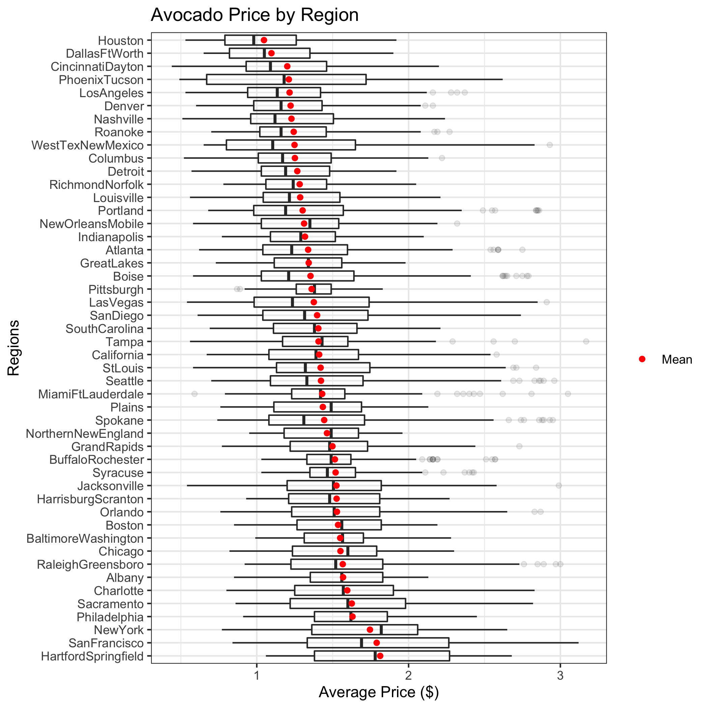

DSCI 522 Avocado Predictors
================
Katie Birchard, Ryan Homer, Andrea Lee
02/02/2020

# Introduction

As millenials, we love avocados. However, as we all know, avocados can
be expensive. Therefore, we decided it would be interesting to
investigate what drives avocado prices. We would like to know what time
of year avocados are least expensive, and where avocados are the
cheapest. Hopefully, the results of this investigation can give us
insight on how to enjoy our beloved avocado toasts without breaking the
bank.

We will be answering the research question: **What is the strongest
predictor of avocado prices in the United States?** Thus, our goal is to
find the feature that most strongly predicts the price of avocados in
the United States. A natural inferential sub-question would be to first
determine if any of the features correlate with avocado prices and if
there is any multicollinearity among the features. From our results, we
can also compute a rank of features by importance.

# Dataset

We analyzed the [avocado prices
dataset](https://www.kaggle.com/neuromusic/avocado-prices) retrieved
from Kaggle and compiled by the Hass Avocado Board using retail scan
data from the United States (Kiggins 2018). The dataset consists of
approximately 18,000 records over 4 years (2015 - 2018). The dataset
contains information about avocado prices, Price Look-Up (PLU) codes,
types (organic or conventional), region purchased in the United States,
volume sold, bags sold, and date sold.

# Analysis

We used a random forest regression model to determine the strongest
predictors of avocado prices. Before we fitted the model, we first
conducted a hypothesis test and a multicollinearity test to determine
which features are significant and should be used in the model. These
tests also identified features that are strongly correlated with one
another, and therefore would be redundant to include in the model.

The features we tested were:

  - `total_volume`: total volume of avocados sold
  - `PLU_4046`: number of of avocados with a price lookup code of 4046
    (small avocado) sold
  - `PLU_4225`: number of of avocados with a price lookup code of 4225
    (large avocado) sold
  - `PLU_4770`: number of of avocados with a price lookup code of 4770
    (x-large avocado) sold
  - `total_bags`: total number of bags of avocados sold
  - `small_bags`: number of small bags of avocados sold
  - `large_bags`: number of large bags of avocados sold
  - `xlarge_bags`: number of x-large bags of avocados sold
  - `type`: type of avocado sold (conventional or organic)
  - `year`: year avocado was sold in
  - `lat`: latitude of the U.S. region the avocado was sold in
  - `lon`: longitude of the U.S. region the avocado was sold in
  - `season`: season avocado was sold in

The features we used to train the random forest regression model on
were:

  - `type`: type of avocado sold (conventional or organic)
  - `lat`: latitude of the U.S. region the avocado was sold in
  - `lon`: longitude of the U.S. region the avocado was sold in
  - `season`: season avocado was sold in
  - *The intuition behind training on these selected features will be
    explained later on in the report.*

The target was:

  - `average_price`: average price of avocado sold

# Exploratory Data Analysis

We wanted to determine which features might be the most important to
include in our random forest regression model. Therefore we plotted
region, latitude, longitude, type, and season against the average price
to visualize the relationships between these variables (figure 1). We
did not plot number of avocados sold from each of the PLU codes,
`PLU_4046`, `PLU_4225`, and `PLU_4770`, or the number of bags sold from
`total_bags`, `small_bags`, `large_bags`, and `xlarge_bags`, because the
relationship between avocado prices and avocados sold could be
reciprocal (i.e. avocados sold may influence the price and vice versa),
leading to a false interpretation. From looking at these relationships,
we can see that some regions, such as Hartford-Springfield and San
Francisco, have higher avocado prices than other regions, such as
Houston. When looking at latitude and longitude, it looks like latitude
has no observable trend with average price, but longitude may have a
slight parabolic trend with average price. We can also clearly see (and
we may have already predicted from our own experience) that organic
avocados tend to be more expensive than non-organic avocados. Finally,
when we observe the seasonal trend of avocado prices, we can see that
perhaps avocados are most expensive in the fall months, and least
expensive during the winter months.

 
**Figure 1.** Average price of avocados in the United States by region,
latitude, longitude, type, and season.

Since we want to ensure the prices in this dataset are relatively
accurate, we compared the average prices in this dataset to another
[study](https://www.statista.com/statistics/493487/average-sales-price-of-avocados-in-the-us/)
published by M. Shahbandeh in February 2019. According to the dataset we
selected, the average price of avocados from 2015 to 2018 was $1.41.
According to Shahbandeh’s study, the average price of avocados from 2015
to 2018 was $1.11 (Shahbandeh 2019). Thus, the average price from our
dataset is slightly higher compared to Shahbandeh’s study. This
discrepancy could be due to the inclusion of organic avocados in this
dataset, which tend to be more expensive. However, the prices are still
similar enough that the observations from this dataset are likely
accurate.

## Hypothesis Test

Before undergoing our main analysis, we first conducted a hypothesis
test to determine if any of the features are correlated with the target.
To conduct a hypothesis test, we fitted an additive linear model and
interpreted the p-values to determine which features are significant. We
chose a significance level of 0.05 as it is the industry standard. We
chose not to choose a stricter significance level (i.e. 0.01 or 0.001)
as we do not believe that predicting avocado prices requires as
conservative of a test.

Based on our EDA, we chose to fit a linear model to conduct our
hypothesis test. To confirm that a linear model would be appropriate for
this dataset, we examined its residual plot. Looking at the residual
plot below, the points are randomly distributed which indicates that a
linear model is appropriate in this case.

**Figure 2.** Residual plot to examine appropriateness of using a linear
model.

At a significance level of 0.05, it appears from the model below that
the following features are significant as their p-values are less than
the significance level:

  - `type`
  - `year`
  - `lat`
  - `lon`
  - `season`
  - `total_volume`
  - `PLU_4046`
  - `PLU_4225`
  - `PLU_4770`

<table>

<caption>

**Table 1**. Hypothesis Test Table.

</caption>

<thead>

<tr>

<th style="text-align:left;">

term

</th>

<th style="text-align:right;">

estimate

</th>

<th style="text-align:right;">

std.error

</th>

<th style="text-align:right;">

statistic

</th>

<th style="text-align:left;">

p.value

</th>

</tr>

</thead>

<tbody>

<tr>

<td style="text-align:left;">

(Intercept)

</td>

<td style="text-align:right;">

\-126.5846962

</td>

<td style="text-align:right;">

5.8377380

</td>

<td style="text-align:right;">

\-21.6838604

</td>

<td style="text-align:left;">

1.91e-102

</td>

</tr>

<tr>

<td style="text-align:left;">

total\_volume

</td>

<td style="text-align:right;">

\-0.0001696

</td>

<td style="text-align:right;">

0.0000632

</td>

<td style="text-align:right;">

\-2.6828953

</td>

<td style="text-align:left;">

0.00731

</td>

</tr>

<tr>

<td style="text-align:left;">

PLU\_4046

</td>

<td style="text-align:right;">

0.0001694

</td>

<td style="text-align:right;">

0.0000632

</td>

<td style="text-align:right;">

2.6798369

</td>

<td style="text-align:left;">

0.00738

</td>

</tr>

<tr>

<td style="text-align:left;">

PLU\_4225

</td>

<td style="text-align:right;">

0.0001698

</td>

<td style="text-align:right;">

0.0000632

</td>

<td style="text-align:right;">

2.6866911

</td>

<td style="text-align:left;">

0.00723

</td>

</tr>

<tr>

<td style="text-align:left;">

PLU\_4770

</td>

<td style="text-align:right;">

0.0001692

</td>

<td style="text-align:right;">

0.0000632

</td>

<td style="text-align:right;">

2.6759652

</td>

<td style="text-align:left;">

0.00746

</td>

</tr>

<tr>

<td style="text-align:left;">

total\_bags

</td>

<td style="text-align:right;">

\-0.0304085

</td>

<td style="text-align:right;">

0.0403553

</td>

<td style="text-align:right;">

\-0.7535183

</td>

<td style="text-align:left;">

0.451

</td>

</tr>

<tr>

<td style="text-align:left;">

small\_bags

</td>

<td style="text-align:right;">

0.0305780

</td>

<td style="text-align:right;">

0.0403553

</td>

<td style="text-align:right;">

0.7577192

</td>

<td style="text-align:left;">

0.449

</td>

</tr>

<tr>

<td style="text-align:left;">

large\_bags

</td>

<td style="text-align:right;">

0.0305770

</td>

<td style="text-align:right;">

0.0403553

</td>

<td style="text-align:right;">

0.7576960

</td>

<td style="text-align:left;">

0.449

</td>

</tr>

<tr>

<td style="text-align:left;">

xlarge\_bags

</td>

<td style="text-align:right;">

0.0305811

</td>

<td style="text-align:right;">

0.0403553

</td>

<td style="text-align:right;">

0.7577960

</td>

<td style="text-align:left;">

0.449

</td>

</tr>

<tr>

<td style="text-align:left;">

typeorganic

</td>

<td style="text-align:right;">

0.4649471

</td>

<td style="text-align:right;">

0.0058180

</td>

<td style="text-align:right;">

79.9147221

</td>

<td style="text-align:left;">

0

</td>

</tr>

<tr>

<td style="text-align:left;">

year

</td>

<td style="text-align:right;">

0.0634157

</td>

<td style="text-align:right;">

0.0028957

</td>

<td style="text-align:right;">

21.8999114

</td>

<td style="text-align:left;">

2.01e-104

</td>

</tr>

<tr>

<td style="text-align:left;">

lat

</td>

<td style="text-align:right;">

0.0045224

</td>

<td style="text-align:right;">

0.0005441

</td>

<td style="text-align:right;">

8.3116710

</td>

<td style="text-align:left;">

1.04e-16

</td>

</tr>

<tr>

<td style="text-align:left;">

lon

</td>

<td style="text-align:right;">

0.0011681

</td>

<td style="text-align:right;">

0.0001653

</td>

<td style="text-align:right;">

7.0670097

</td>

<td style="text-align:left;">

1.66e-12

</td>

</tr>

<tr>

<td style="text-align:left;">

seasonSpring

</td>

<td style="text-align:right;">

\-0.1872143

</td>

<td style="text-align:right;">

0.0073685

</td>

<td style="text-align:right;">

\-25.4072382

</td>

<td style="text-align:left;">

5.14e-139

</td>

</tr>

<tr>

<td style="text-align:left;">

seasonSummer

</td>

<td style="text-align:right;">

\-0.0690990

</td>

<td style="text-align:right;">

0.0076073

</td>

<td style="text-align:right;">

\-9.0832990

</td>

<td style="text-align:left;">

1.2e-19

</td>

</tr>

<tr>

<td style="text-align:left;">

seasonWinter

</td>

<td style="text-align:right;">

\-0.2515148

</td>

<td style="text-align:right;">

0.0073416

</td>

<td style="text-align:right;">

\-34.2587737

</td>

<td style="text-align:left;">

2.59e-246

</td>

</tr>

</tbody>

</table>

However, we should be cautious not to use the p-value significance as a
stand alone measure to determine if these features are correlated with
the target.

## Multicollinearity Test

Next, we conducted a multicollinearity test to check for any
redundancies between features. Under the assumption that the data can be
modelled linearly after observing the residual plot, we selected the
continuous numerical predictors, computed the correlation matrix, and
wrangled the data into a plottable dataframe (*Ggplot2 : Quick
Correlation Matrix Heatmap - R Software and Data Visualization*, n.d.).

**Figure 3.** Correlation matrix of continuous features.

Overall, there is fairly high collinearity between many of the
predictors. This was expected, since they all deal with volume or number
of avocados sold, be it by PLU code, bag type or total volume. In
particular, `total_bags` and `total_volume` were expected to be highly
correlated with other predictors that were sub-quantities of these
totals. Due to the high correlation, including all these predictors in a
prediction model would probably lead to overfitting.

To verify the result from the correlation matrix above, we also computed
the variance inflation (VIF) scores from the `car` package.

<table class="table" style="margin-left: auto; margin-right: auto;">

<caption>

**Table 2.** Variance inflation scores of continuous features.

</caption>

<thead>

<tr>

<th style="text-align:left;">

name

</th>

<th style="text-align:right;">

value

</th>

</tr>

</thead>

<tbody>

<tr>

<td style="text-align:left;">

total\_volume

</td>

<td style="text-align:right;">

3.775250e+08

</td>

</tr>

<tr>

<td style="text-align:left;">

PLU\_4046

</td>

<td style="text-align:right;">

6.022176e+07

</td>

</tr>

<tr>

<td style="text-align:left;">

PLU\_4225

</td>

<td style="text-align:right;">

5.317631e+07

</td>

</tr>

<tr>

<td style="text-align:left;">

PLU\_4770

</td>

<td style="text-align:right;">

1.060176e+06

</td>

</tr>

<tr>

<td style="text-align:left;">

total\_bags

</td>

<td style="text-align:right;">

1.251477e+13

</td>

</tr>

<tr>

<td style="text-align:left;">

small\_bags

</td>

<td style="text-align:right;">

9.390446e+12

</td>

</tr>

<tr>

<td style="text-align:left;">

large\_bags

</td>

<td style="text-align:right;">

6.580236e+11

</td>

</tr>

<tr>

<td style="text-align:left;">

xlarge\_bags

</td>

<td style="text-align:right;">

1.322641e+10

</td>

</tr>

</tbody>

</table>

The high VIF scores suggest extremely high collinearity for these
variables in a linear model. Therefore, we will be careful about using
these features as they are probably ineffective predictors of the
average avocado price.

# Results

## Random Forest

We fitted a random forest regressor model using the significant features
from the analysis above (`lat`, `lon`, `type`, and `season`). We used
one hot encoding to scale the categorical features (`type` and `season`)
and standard scaling tto scale the numerical features(`lat` and `lon`).
We used randomized cross validation to determine the optimal values for
maximum depth and number of estimators. We calculated the average
(validation) scores using cross validation to determine how well our
model was performing.

<table>

<caption>

**Table 3**. Cross-validation scores for each of the folds in the random
forest regression model.

</caption>

<thead>

<tr>

<th style="text-align:right;">

Fold

</th>

<th style="text-align:right;">

Neg Mean Squared
    Error

</th>

</tr>

</thead>

<tbody>

<tr>

<td style="text-align:right;">

1

</td>

<td style="text-align:right;">

\-0.0624845

</td>

</tr>

<tr>

<td style="text-align:right;">

2

</td>

<td style="text-align:right;">

\-0.0714751

</td>

</tr>

<tr>

<td style="text-align:right;">

3

</td>

<td style="text-align:right;">

\-0.0623316

</td>

</tr>

<tr>

<td style="text-align:right;">

4

</td>

<td style="text-align:right;">

\-0.1281574

</td>

</tr>

<tr>

<td style="text-align:right;">

5

</td>

<td style="text-align:right;">

\-0.1396265

</td>

</tr>

</tbody>

</table>

    ## [1] "The average cross-validation score for random forest regression is: 0.093"

From this model, we identified the relative importance of each feature.

<table>

<caption>

**Table 4**. The relative feature importances determined by random
forest regression model.

</caption>

<thead>

<tr>

<th style="text-align:left;">

Feature Names

</th>

<th style="text-align:right;">

Importance

</th>

</tr>

</thead>

<tbody>

<tr>

<td style="text-align:left;">

type\_organic

</td>

<td style="text-align:right;">

0.3969294

</td>

</tr>

<tr>

<td style="text-align:left;">

type\_conventional

</td>

<td style="text-align:right;">

0.2099989

</td>

</tr>

<tr>

<td style="text-align:left;">

lon

</td>

<td style="text-align:right;">

0.1958670

</td>

</tr>

<tr>

<td style="text-align:left;">

lat

</td>

<td style="text-align:right;">

0.1044871

</td>

</tr>

<tr>

<td style="text-align:left;">

season\_Fall

</td>

<td style="text-align:right;">

0.0518205

</td>

</tr>

<tr>

<td style="text-align:left;">

season\_Summer

</td>

<td style="text-align:right;">

0.0274426

</td>

</tr>

<tr>

<td style="text-align:left;">

season\_Winter

</td>

<td style="text-align:right;">

0.0105028

</td>

</tr>

<tr>

<td style="text-align:left;">

season\_Spring

</td>

<td style="text-align:right;">

0.0029517

</td>

</tr>

</tbody>

</table>

According to the random forest regression, the top predictor of avocado
prices is `type` (i.e. whether the avocado is organic or conventional).
This result aligned with our expectations, as our EDA depicted
differences in distributions between organic and conventional avocado
prices.

## Linear Regression

To compare, we fitted a linear regression model using L2 regularization.
We also used randomized cross validation to determine the optimal value
for the complexity penalization factor, alpha. Again, we calculated the
average (validation) scores using cross validation to determine how well
our model was performing.

<table>

<caption>

**Table 5**. Cross-validation scores for each of the folds in the linear
regression model.

</caption>

<thead>

<tr>

<th style="text-align:right;">

Fold

</th>

<th style="text-align:right;">

Neg Mean Squared
    Error

</th>

</tr>

</thead>

<tbody>

<tr>

<td style="text-align:right;">

1

</td>

<td style="text-align:right;">

\-0.4589097

</td>

</tr>

<tr>

<td style="text-align:right;">

2

</td>

<td style="text-align:right;">

0.2206909

</td>

</tr>

<tr>

<td style="text-align:right;">

3

</td>

<td style="text-align:right;">

0.4166477

</td>

</tr>

<tr>

<td style="text-align:right;">

4

</td>

<td style="text-align:right;">

\-0.0509614

</td>

</tr>

<tr>

<td style="text-align:right;">

5

</td>

<td style="text-align:right;">

0.0048601

</td>

</tr>

</tbody>

</table>

    ## [1] "The average cross-validation score for linear regression is: 0.026"

The linear regression model had even lower error than the random forest
regression model. This may indicate that linear regression may be a
better model for predicting average avocado prices.

From the linear regression model, we also identified the relative
weights of each of the coefficients.

<table>

<caption>

**Table 6**. The relative feature weights determined by the linear
regression model.

</caption>

<thead>

<tr>

<th style="text-align:left;">

Feature Names

</th>

<th style="text-align:right;">

Weights

</th>

</tr>

</thead>

<tbody>

<tr>

<td style="text-align:left;">

type\_organic

</td>

<td style="text-align:right;">

0.2497839

</td>

</tr>

<tr>

<td style="text-align:left;">

season\_Fall

</td>

<td style="text-align:right;">

0.1217987

</td>

</tr>

<tr>

<td style="text-align:left;">

season\_Summer

</td>

<td style="text-align:right;">

0.0503069

</td>

</tr>

<tr>

<td style="text-align:left;">

lat

</td>

<td style="text-align:right;">

0.0409049

</td>

</tr>

<tr>

<td style="text-align:left;">

lon

</td>

<td style="text-align:right;">

0.0369545

</td>

</tr>

<tr>

<td style="text-align:left;">

season\_Spring

</td>

<td style="text-align:right;">

\-0.0617987

</td>

</tr>

<tr>

<td style="text-align:left;">

season\_Winter

</td>

<td style="text-align:right;">

\-0.1103069

</td>

</tr>

<tr>

<td style="text-align:left;">

type\_conventional

</td>

<td style="text-align:right;">

\-0.2497839

</td>

</tr>

</tbody>

</table>

When looking at the relative feature weights from the linear regression
model, we need to account for the absolute weight. Therefore, comparing
the two models, random forest regression and linear regression, we can
see that both indicated `type` as the most important predictor of
avocado pricing (figure 4).

**Figure 4.** Relative feature importances for random forest regression,
and feature weights for linear regression.

# Discussion

## Conclusion

The random forest regression model predicted that `type` is the most
important feature for predicting avocado price. This result is expected,
since we observed a significant difference in the distribution of
average prices between organic and conventional avocados during the
exploratory data analysis and hypothesis testing. We also expected this
result from previous experience buying avocados. Organic avocados are
grown without the use of pesticides, and therefore produce a lower yield
per growing season, ultimately resulting in a more expensive avocado.

The `region` feature also seemed to play some importance in the pricing
of avocados. For instance, regions such as Hartford-Springfield and San
Francisco were the third and fourth most important predictors of average
avocado price. It is unclear how these regions affect avocado prices. A
possible explanation could be that some regions, such as San Francisco,
have significantly higher priced avocados because of the fact that the
cost of living in these regions significantly higher than other regions
in the United States. On the other hand, other regions, such as Texas,
have significantly lower priced avocados because avocados are grown
these regions.

## Areas of Improvement

Our model could be improved by the inclusion of even more predictive
features or more data. Although it seems the predictors we did have
worked quite well, we could possibly gain even more insight from
predictors such as weather, grocery store chain, and popularity in the
media or public perception. In addition, the data that we do have only
spans four years. If we have data from a longer time span (e.g. 50
years), we might be able to more effectively determine the accuracy of
our chosen predictors.

We could also use more feature selection techniques to support the
conclusions that we made from our random forest and linear regression
models. Using techniques such as forward selection or recursive feature
selection may allow us to make stronger conclusions about which features
really do predict avocado prices.

# R and Python Packages

To perform this analysis, we used the R and Python programming languages
(R Core Team 2019; Van Rossum and Drake 2009). As well, the following R
packages were used: `broom` (Robinson and Hayes 2019), `caret` (Kuhn
2020), `car` (Fox and Weisberg 2019), `docopt` (de Jonge 2018),
`feather` (Wickham 2019), `ggpubr` (Kassambara 2018), `here`(Müller
2017), `kableExtra` (Zhu 2019), `knitr` (Xie 2014), `lubridate`
(Grolemund and Wickham 2011), `magick`(Ooms 2020), `RCurl` (Temple Lang
2020), `reshape2` (Wickham 2007), and `tidyverse` (Wickham et al. 2019).
The following Python packages were used: `altair` (Sievert 2018),
`numpy` (Oliphant 2006), `pandas` (McKinney and others 2010),
`pyarrow`(Team 2017), `scikit-learn` (Pedregosa et al. 2011), and
`selenium` (Salunke 2014). And the following OS package was used:
`chromedriver`(Google, n.d.).

# References

de Jonge, Edwin. 2018. *Docopt: Command-Line Interface Specification
Language*. <https://CRAN.R-project.org/package=docopt>.

Fox, John, and Sanford Weisberg. 2019. *An R Companion to Applied
Regression*. Third. Thousand Oaks CA: Sage.
<https://socialsciences.mcmaster.ca/jfox/Books/Companion/>.

*Ggplot2 : Quick Correlation Matrix Heatmap - R Software and Data
Visualization*. n.d. STHTDA.
<http://www.sthda.com/english/wiki/ggplot2-quick-correlation-matrix-heatmap-r-software-and-data-visualization>.

Google. n.d. *ChromeDriver - Webdriver for Chrome*.
<https://chromedriver.chromium.org/downloads>.

Grolemund, Garrett, and Hadley Wickham. 2011. “Dates and Times Made Easy
with lubridate.” *Journal of Statistical Software* 40 (3): 1–25.
<http://www.jstatsoft.org/v40/i03/>.

Kassambara, Alboukadel. 2018. *Ggpubr: ’Ggplot2’ Based Publication Ready
Plots*. <https://CRAN.R-project.org/package=ggpubr>.

Kiggins, J. 2018. “Avocado Prices: Historical Data on Avocado Prices and
Sales Volume in Multiple Us Markets.”
<https://www.kaggle.com/neuromusic/avocado-prices>.

Kuhn, Max. 2020. *Caret: Classification and Regression Training*.
<https://CRAN.R-project.org/package=caret>.

McKinney, Wes, and others. 2010. “Data Structures for Statistical
Computing in Python.” In *Proceedings of the 9th Python in Science
Conference*, 445:51–56. Austin, TX.

Müller, Kirill. 2017. *Here: A Simpler Way to Find Your Files*.
<https://CRAN.R-project.org/package=here>.

Oliphant, Travis E. 2006. “A Guide to Numpy.” Trelgol Publishing USA.

Ooms, Jeroen. 2020. *Magick: Advanced Graphics and Image-Processing in
R*. <https://CRAN.R-project.org/package=magick>.

Pedregosa, F., G. Varoquaux, A. Gramfort, V. Michel, B. Thirion, O.
Grisel, M. Blondel, et al. 2011. “Scikit-Learn: Machine Learning in
Python.” *Journal of Machine Learning Research* 12: 2825–30.

R Core Team. 2019. *R: A Language and Environment for Statistical
Computing*. Vienna, Austria: R Foundation for Statistical Computing.
<https://www.R-project.org/>.

Robinson, David, and Alex Hayes. 2019. *Broom: Convert Statistical
Analysis Objects into Tidy Tibbles*.
<https://CRAN.R-project.org/package=broom>.

Salunke, Sagar Shivaji. 2014. *Selenium Webdriver in Python: Learn with
Examples*. 1st ed. North Charleston, SC, USA: CreateSpace Independent
Publishing Platform.

Shahbandeh, M. 2019. “Average Sales Price of Avocados in the U.s.
2012-2018.”
<https://www.statista.com/statistics/493487/average-sales-price-of-avocados-in-the-us/>.

Sievert, Jacob VanderPlas AND Brian E. Granger AND Jeffrey Heer AND
Dominik Moritz AND Kanit Wongsuphasawat AND Arvind Satyanarayan AND
Eitan Lees AND Ilia Timofeev AND Ben Welsh AND Scott. 2018. “Altair:
Interactive Statistical Visualizations for Python.” *The Journal of Open
Source Software* 3 (32). <http://idl.cs.washington.edu/papers/altair>.

Team, Apache Arrow. 2017. *Pyarrow Documentation*.
<https://buildmedia.readthedocs.org/media/pdf/pyarrow/latest/pyarrow.pdf>.

Temple Lang, Duncan. 2020. *RCurl: General Network (Http/Ftp/...) Client
Interface for R*. <https://CRAN.R-project.org/package=RCurl>.

Van Rossum, Guido, and Fred L. Drake. 2009. *Python 3 Reference Manual*.
Scotts Valley, CA: CreateSpace.

Wickham, Hadley. 2007. “Reshaping Data with the reshape Package.”
*Journal of Statistical Software* 21 (12): 1–20.
<http://www.jstatsoft.org/v21/i12/>.

———. 2019. *Feather: R Bindings to the Feather ’Api’*.
<https://CRAN.R-project.org/package=feather>.

Wickham, Hadley, Mara Averick, Jennifer Bryan, Winston Chang, Lucy
D’Agostino McGowan, Romain François, Garrett Grolemund, et al. 2019.
“Welcome to the tidyverse.” *Journal of Open Source Software* 4 (43):
1686. <https://doi.org/10.21105/joss.01686>.

Xie, Yihui. 2014. “Knitr: A Comprehensive Tool for Reproducible Research
in R.” In *Implementing Reproducible Computational Research*, edited by
Victoria Stodden, Friedrich Leisch, and Roger D. Peng. Chapman;
Hall/CRC. <http://www.crcpress.com/product/isbn/9781466561595>.

Zhu, Hao. 2019. *KableExtra: Construct Complex Table with ’Kable’ and
Pipe Syntax*. <https://CRAN.R-project.org/package=kableExtra>.

