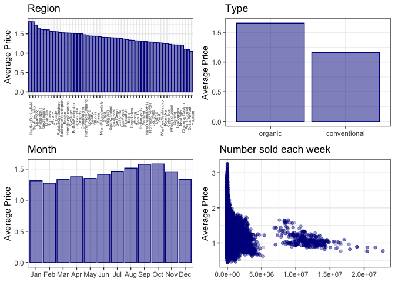

DSCI 522 Exploratory Data Analysis
================
Katie Birchard, Andrea Lee, Ryan Homer

## **Research Question**: What is the strongest predictor of avocado prices in the United States?

The dataset we chose for this project was compiled by the Hass Avocado
Board using retail scan data, and was retrieved from Kaggle at this
[link](https://www.kaggle.com/neuromusic/avocado-prices?fbclid=IwAR35kKP-Fz0yYZj-QqsZ6iNDSVnLBncxTOG3Cce3F5EupQTVHo85ecn7SBo).
The dataset includes 23 columns and 18,249 rows of data. Most of the
columns/features are of type numeric, except for `region` and `type`,
which are categorical, and `Date`, which is a date-time object. The data
is ordered by year of `Date` (with months descending), starting in 2015
and ending in 2018. Each row of the dataframe represents a week in
avocado sales, including information about the average price of an
avocado for each region in the United States, number of bags sold,
number of each PLU code sold, total volume sold, number of bags sold,
and number of type sold (organic vs conventional).

Preliminary exploration of the dataset has given some insight to the
potential features of our model. First, it looks like the PLU code
`4770` does not have as many examples as the other PLU codes, which
could be due to missing data or rarity of that avocado variety. It also
looks like `XLarge Bags` might not be sold everywhere, considering that
none were sold in either the head or the tail of the data. We also want
to make sure that each categorical variable is represented equally in
the dataset. It appears that 54 unique regions are represented in the
dataset, each with 338 observations. In addition, there are only 2 types
of avocado, with `conventional` having 9126 observations and `organic`
having 9123 observations. This slight difference between types is minor,
and so should not affect analysis.

Since we want to ensure the prices in this dataset are relatively
accurate, we compared the average prices in this dataset to another
[study](https://www.statista.com/statistics/493487/average-sales-price-of-avocados-in-the-us/)
published by M. Shahbandeh in February 2019. According to the dataset we
selected, the average price of avocados from 2015 to 2018 was $1.41.

    ## # A tibble: 1 x 6
    ##   minimum    q1 median  mean    q3 maximum
    ##     <dbl> <dbl>  <dbl> <dbl> <dbl>   <dbl>
    ## 1    0.44   1.1   1.37  1.41  1.66    3.25

According to Shahbandeh’s study, the average price of avocados in 2015
was $1.03, in 2016 was $1.04, in 2017 was $1.28, and in 2018 was $1.10.
Thus, the average price from our dataset is slightly higher compared to
Shahbandeh’s study. This discrepancy could be due to the inclusion of
organic avocados in this dataset, which tend to be more expensive.
However, the prices are still similar enough that the observations from
this dataset are likely accurate.

## Splitting the data into train and test sets

Before we begin visualizing the data, we will split the dataset into 80%
training data and 20% test data. The test data will not be used for the
exploratory dataset, and will only be used for testing the finalized
model at the end of the project.

## Exploratory analysis on the training dataset

We wanted to determine which features might be the most important to
include in our random forest regression model. Therefore we plotted
region, type, month, and number sold each week against the average price
to visualize the relationships between these variables (figure 1). From
looking at these relationships, we can see that some regions, such as
Hartford-Springfield and San Francisco, have higher avocado prices than
other regions, such as Houston. We can also clearly see (and we may have
already predicted from our own experience) that organic avocados are
likely more expensive than non-organic avocados. When we observe the
monthly trend of avocado prices, we can see that perhaps avocados are
most expensive in the fall months, and least expensive during the winter
months. Finally, the number of avocados sold each week may also have
play a role in avocado prices. However, since avocado prices may be
predicting the number sold in this relationship, the number sold may not
be the best feature to use in our model.

<!-- -->

**Figure 1.** Average price of avocados in the United States by region,
type, month, and number of total avocados sold each week.

We also plotted the average avocado price over time to get an idea of
how the price has fluctuated and whether there were any outlier months
in the dataset (figure 2). It appears that there was a sharp incline in
avocado prices in August-October of 2017, which may influence our
analysis.

<!-- -->

**Figure 2.** Average number of avocados sold per week between 2015 and
2018.

## References

Kiggins, J. “Avocado Prices: Historical data on avocado prices and sales
volume in multiple US markets.” May 2018. [Web
Link](https://www.kaggle.com/neuromusic/avocado-prices).

Shahbandeh, M. “Average sales price of avocados in the U.S. 2012-2018.”
February 2019. [Web
Link](https://www.statista.com/statistics/493487/average-sales-price-of-avocados-in-the-us/)
