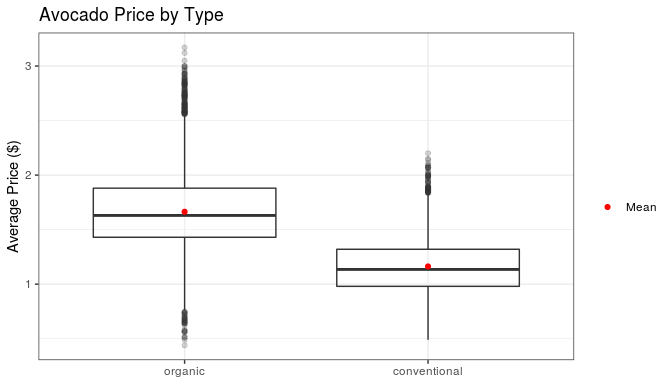
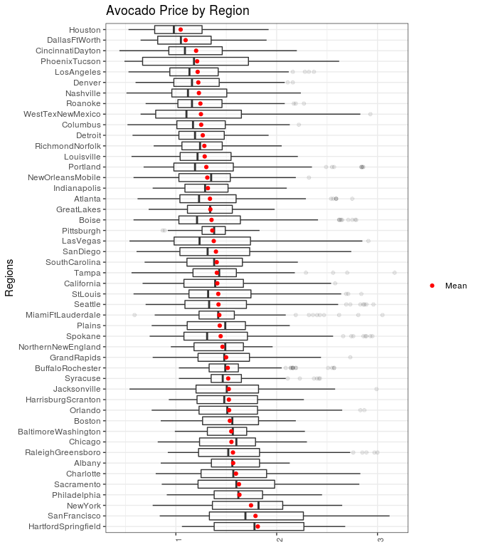
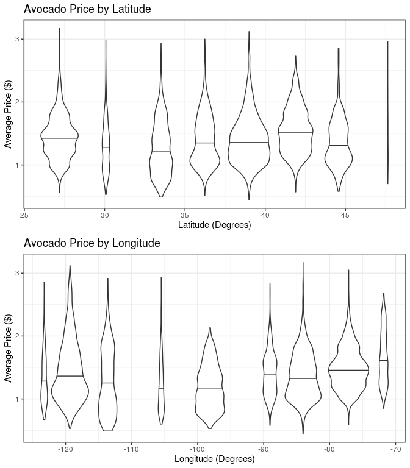
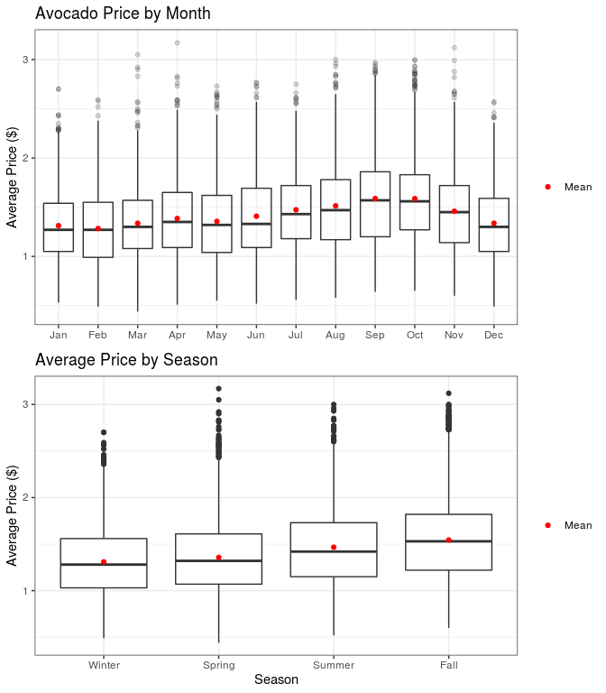

DSCI 522 Exploratory Data Analysis
================
Katie Birchard, Andrea Lee, Ryan Homer
January 31, 2020

## **Research Question**: What is the strongest predictor of avocado prices in the United States?

``` r
# Check the number of rows
nrow(avocado)
```

    ## [1] 12978

``` r
# Check the number of columns
ncol(avocado)
```

    ## [1] 19

``` r
# Check the structure of the dataset
# Here we can see the headers and type of each potential feature
str(avocado)
```

    ## Classes 'tbl_df', 'tbl' and 'data.frame':    12978 obs. of  19 variables:
    ##  $ X1           : num  0 1 2 3 4 5 7 8 10 11 ...
    ##  $ date         : Date, format: "2015-12-27" "2015-12-20" ...
    ##  $ average_price: num  1.33 1.35 0.93 1.08 1.28 1.26 0.98 1.02 1.12 1.28 ...
    ##  $ total_volume : num  64237 54877 118220 78992 51040 ...
    ##  $ PLU_4046     : num  1037 674 795 1132 941 ...
    ##  $ PLU_4225     : num  54455 44639 109150 71976 43838 ...
    ##  $ PLU_4770     : num  48.2 58.3 130.5 72.6 75.8 ...
    ##  $ total_bags   : num  8697 9506 8145 5811 6184 ...
    ##  $ small_bags   : num  8604 9408 8042 5677 5986 ...
    ##  $ large_bags   : num  93.2 97.5 103.1 133.8 197.7 ...
    ##  $ xlarge_bags  : num  0 0 0 0 0 0 0 0 0 0 ...
    ##  $ type         : chr  "conventional" "conventional" "conventional" "conventional" ...
    ##  $ year         : num  2015 2015 2015 2015 2015 ...
    ##  $ region       : chr  "Albany" "Albany" "Albany" "Albany" ...
    ##  $ month        : Factor w/ 12 levels "Jan","Feb","Mar",..: 12 12 12 12 11 11 11 11 10 10 ...
    ##  $ year_month   : chr  "2015-12" "2015-12" "2015-12" "2015-12" ...
    ##  $ lat          : num  42.7 42.7 42.7 42.7 42.7 ...
    ##  $ lon          : num  -73.8 -73.8 -73.8 -73.8 -73.8 ...
    ##  $ season       : chr  "Winter" "Winter" "Winter" "Winter" ...

``` r
# Looking at the top of the data
head(avocado[, c(2:10)])
```

    ## # A tibble: 6 x 9
    ##   date       average_price total_volume PLU_4046 PLU_4225 PLU_4770 total_bags
    ##   <date>             <dbl>        <dbl>    <dbl>    <dbl>    <dbl>      <dbl>
    ## 1 2015-12-27          1.33       64237.    1037.   54455.     48.2      8697.
    ## 2 2015-12-20          1.35       54877.     674.   44639.     58.3      9506.
    ## 3 2015-12-13          0.93      118220.     795.  109150.    130.       8145.
    ## 4 2015-12-06          1.08       78992.    1132    71976.     72.6      5811.
    ## 5 2015-11-29          1.28       51040.     941.   43838.     75.8      6184.
    ## 6 2015-11-22          1.26       55980.    1184.   48068.     43.6      6684.
    ## # … with 2 more variables: small_bags <dbl>, large_bags <dbl>

``` r
head(avocado[, c(11:19)])
```

    ## # A tibble: 6 x 9
    ##   xlarge_bags type          year region month year_month   lat   lon season
    ##         <dbl> <chr>        <dbl> <chr>  <fct> <chr>      <dbl> <dbl> <chr> 
    ## 1           0 conventional  2015 Albany Dec   2015-12     42.7 -73.8 Winter
    ## 2           0 conventional  2015 Albany Dec   2015-12     42.7 -73.8 Winter
    ## 3           0 conventional  2015 Albany Dec   2015-12     42.7 -73.8 Winter
    ## 4           0 conventional  2015 Albany Dec   2015-12     42.7 -73.8 Winter
    ## 5           0 conventional  2015 Albany Nov   2015-11     42.7 -73.8 Fall  
    ## 6           0 conventional  2015 Albany Nov   2015-11     42.7 -73.8 Fall

``` r
# Looking at the bottom of the data
tail(avocado[, c(2:10)])
```

    ## # A tibble: 6 x 9
    ##   date       average_price total_volume PLU_4046 PLU_4225 PLU_4770 total_bags
    ##   <date>             <dbl>        <dbl>    <dbl>    <dbl>    <dbl>      <dbl>
    ## 1 2018-02-25          1.57       18421.    1974.    2483.       0      13964.
    ## 2 2018-02-18          1.56       17597.    1892.    1928.       0      13777.
    ## 3 2018-02-04          1.63       17075.    2047.    1529.       0      13499.
    ## 4 2018-01-28          1.71       13888.    1192.    3432.       0       9265.
    ## 5 2018-01-14          1.93       16205.    1528.    2981.     727.     10970.
    ## 6 2018-01-07          1.62       17490.    2895.    2356.     225.     12014.
    ## # … with 2 more variables: small_bags <dbl>, large_bags <dbl>

``` r
tail(avocado[, c(11:19)])
```

    ## # A tibble: 6 x 9
    ##   xlarge_bags type     year region           month year_month   lat   lon season
    ##         <dbl> <chr>   <dbl> <chr>            <fct> <chr>      <dbl> <dbl> <chr> 
    ## 1           0 organic  2018 WestTexNewMexico Feb   2018-02     34.3 -106. Winter
    ## 2           0 organic  2018 WestTexNewMexico Feb   2018-02     34.3 -106. Winter
    ## 3           0 organic  2018 WestTexNewMexico Feb   2018-02     34.3 -106. Winter
    ## 4           0 organic  2018 WestTexNewMexico Jan   2018-01     34.3 -106. Winter
    ## 5           0 organic  2018 WestTexNewMexico Jan   2018-01     34.3 -106. Winter
    ## 6           0 organic  2018 WestTexNewMexico Jan   2018-01     34.3 -106. Winter

``` r
# How many regions in the US are included in the dataset?
unique(avocado$region)
```

    ##  [1] "Albany"              "Atlanta"             "BaltimoreWashington"
    ##  [4] "Boise"               "Boston"              "BuffaloRochester"   
    ##  [7] "California"          "Charlotte"           "Chicago"            
    ## [10] "CincinnatiDayton"    "Columbus"            "DallasFtWorth"      
    ## [13] "Denver"              "Detroit"             "GrandRapids"        
    ## [16] "GreatLakes"          "HarrisburgScranton"  "HartfordSpringfield"
    ## [19] "Houston"             "Indianapolis"        "Jacksonville"       
    ## [22] "LasVegas"            "LosAngeles"          "Louisville"         
    ## [25] "MiamiFtLauderdale"   "Nashville"           "NewOrleansMobile"   
    ## [28] "NewYork"             "NorthernNewEngland"  "Orlando"            
    ## [31] "Philadelphia"        "PhoenixTucson"       "Pittsburgh"         
    ## [34] "Plains"              "Portland"            "RaleighGreensboro"  
    ## [37] "RichmondNorfolk"     "Roanoke"             "Sacramento"         
    ## [40] "SanDiego"            "SanFrancisco"        "Seattle"            
    ## [43] "SouthCarolina"       "Spokane"             "StLouis"            
    ## [46] "Syracuse"            "Tampa"               "WestTexNewMexico"

``` r
table(avocado$region)
```

    ## 
    ##              Albany             Atlanta BaltimoreWashington               Boise 
    ##                 274                 274                 256                 253 
    ##              Boston    BuffaloRochester          California           Charlotte 
    ##                 259                 270                 259                 279 
    ##             Chicago    CincinnatiDayton            Columbus       DallasFtWorth 
    ##                 259                 257                 285                 268 
    ##              Denver             Detroit         GrandRapids          GreatLakes 
    ##                 273                 275                 270                 283 
    ##  HarrisburgScranton HartfordSpringfield             Houston        Indianapolis 
    ##                 269                 257                 261                 262 
    ##        Jacksonville            LasVegas          LosAngeles          Louisville 
    ##                 282                 262                 264                 270 
    ##   MiamiFtLauderdale           Nashville    NewOrleansMobile             NewYork 
    ##                 277                 271                 279                 278 
    ##  NorthernNewEngland             Orlando        Philadelphia       PhoenixTucson 
    ##                 272                 263                 264                 285 
    ##          Pittsburgh              Plains            Portland   RaleighGreensboro 
    ##                 281                 270                 273                 275 
    ##     RichmondNorfolk             Roanoke          Sacramento            SanDiego 
    ##                 262                 266                 265                 288 
    ##        SanFrancisco             Seattle       SouthCarolina             Spokane 
    ##                 270                 269                 270                 273 
    ##             StLouis            Syracuse               Tampa    WestTexNewMexico 
    ##                 283                 274                 281                 268

``` r
# There are 54 unique regions, each with 338 observations

#We want to make sure that the data is consistent. For instance, for this dataset we want to make #sure that we have an equal number of observations for each region.

# How many types of avocado are there?
unique(avocado$type)
```

    ## [1] "conventional" "organic"

``` r
table(avocado$type)
```

    ## 
    ## conventional      organic 
    ##         6500         6478

``` r
# Looks like there are 3 more conventional observations than organic
```

The dataset we chose for this project was compiled by the Hass Avocado
Board using retail scan data, and was retrieved from Kaggle at this
[link](https://www.kaggle.com/neuromusic/avocado-prices?fbclid=IwAR35kKP-Fz0yYZj-QqsZ6iNDSVnLBncxTOG3Cce3F5EupQTVHo85ecn7SBo).
The dataset includes 23 columns and 18,249 rows of data. Most of the
columns/features are of type numeric, except for `region` and `type`,
which are categorical, and `Date`, which is a date-time object. The data
is ordered by year of `Date` (with months descending), starting in 2015
and ending in 2018. Each row of the dataframe represents a week in
avocado sales, including information about the average price of an
avocado for each region in the United States, number of bags sold,
number of each PLU code sold, total volume sold, number of bags sold,
and number of type sold (organic vs conventional).

Preliminary exploration of the dataset has given some insight to the
potential features of our model. First, it looks like the PLU code
`4770` does not have as many examples as the other PLU codes, which
could be due to missing data or rarity of that avocado variety. It also
looks like `XLarge Bags` might not be sold everywhere, considering that
none were sold in either the head or the tail of the data. We also want
to make sure that each categorical variable is represented equally in
the dataset. It appears that 54 unique regions are represented in the
dataset, each with 338 observations. In addition, there are only 2 types
of avocado, with `conventional` having 9126 observations and `organic`
having 9123 observations. This slight difference between types is minor,
and so should not affect analysis.

Since we want to ensure the prices in this dataset are relatively
accurate, we compared the average prices in this dataset to another
[study](https://www.statista.com/statistics/493487/average-sales-price-of-avocados-in-the-us/)
published by M. Shahbandeh in February 2019. According to the dataset we
selected, the average price of avocados from 2015 to 2018 was $1.41.

``` r
broom::tidy(summary(avocado$average_price))
```

    ## # A tibble: 1 x 6
    ##   minimum    q1 median  mean    q3 maximum
    ##     <dbl> <dbl>  <dbl> <dbl> <dbl>   <dbl>
    ## 1    0.44   1.1   1.38  1.41  1.67    3.17

According to Shahbandeh’s study, the average price of avocados in 2015
was $1.03, in 2016 was $1.04, in 2017 was $1.28, and in 2018 was $1.10.
Thus, the average price from our dataset is slightly higher compared to
Shahbandeh’s study. This discrepancy could be due to the inclusion of
organic avocados in this dataset, which tend to be more expensive.
However, the prices are still similar enough that the observations from
this dataset are likely accurate.

## Splitting the data into train and test sets

Before we begin visualizing the data, we will split the dataset into 80%
training data and 20% test data. The test data will not be used for the
exploratory dataset, and will only be used for testing the finalized
model at the end of the project.

## Exploratory analysis on the training dataset

We wanted to determine which features might be the most important to
include in our random forest regression model. Therefore we plotted
region, type, month, and number sold each week against the average price
to visualize the relationships between these variables (figure 1). We
did not plot number of avocados sold from each of the PLU codes,
`PLU_4046`, `PLU_4225`, and `PLU_4770`, or the number of bags sold from
`total_bags`, `small_bags`, `large_bags`, and `xlarge_bags`, because the
relationship between avocado prices and avocados sold could be
reciprocal (i.e. avocados sold may influence the price and vice versa),
leading to a false interpretation. From looking at these relationships,
we can clearly see (and we may have already predicted from our own
experience) that organic avocados are likely more expensive than
non-organic avocados (figure 1). We can also see that some regions, such
as Hartford-Springfield and San Francisco, have higher avocado prices
than other regions, such as Houston (figure 2). However, when we further
looked into how the trend between avocado prices and location, we found
that the avocado prices fluctuate wildly with latitude. With longitude,
it appears that there could be a relationship, as there is almost a
parabolic trend in price as longitude increases. Finally, when we
observe the monthly and seasonal trend of avocado prices, we can see
that perhaps avocados are most expensive in the fall months, and least
expensive during the winter months (figure 3).

``` r
# What is the distribution of the different categorical features?
# Make tables

region_summary <- avocado %>%
  count(region)

region_summary <- avocado %>%
  group_by(region) %>%
  summarize(min = min(average_price),
            lower_quartile = quantile(average_price, 0.25),
            mean = mean(average_price),
            median = median(average_price),
            upper_quantile = quantile(average_price, 0.75),
            max = max(average_price))  %>%
  left_join(region_summary)

region_summary_table <- kable(region_summary,
                              caption = "Table 1. Summary statistics for the average price of avocados in all regions in the United States.")

region_summary_table
```

| region              |  min | lower\_quartile |     mean | median | upper\_quantile |  max |   n |
| :------------------ | ---: | --------------: | -------: | -----: | --------------: | ---: | --: |
| Albany              | 0.85 |          1.3525 | 1.568431 |  1.560 |          1.8300 | 2.13 | 274 |
| Atlanta             | 0.62 |          1.0400 | 1.338321 |  1.230 |          1.5975 | 2.75 | 274 |
| BaltimoreWashington | 0.99 |          1.3125 | 1.549453 |  1.565 |          1.7025 | 2.28 | 256 |
| Boise               | 0.58 |          1.0300 | 1.353913 |  1.210 |          1.6400 | 2.79 | 253 |
| Boston              | 0.85 |          1.2650 | 1.535483 |  1.560 |          1.8200 | 2.19 | 259 |
| BuffaloRochester    | 1.03 |          1.3300 | 1.514630 |  1.490 |          1.6200 | 2.57 | 270 |
| California          | 0.67 |          1.0800 | 1.411042 |  1.390 |          1.6700 | 2.58 | 259 |
| Charlotte           | 0.80 |          1.2500 | 1.596237 |  1.570 |          1.9000 | 2.83 | 279 |
| Chicago             | 0.82 |          1.2350 | 1.551197 |  1.600 |          1.7900 | 2.30 | 259 |
| CincinnatiDayton    | 0.44 |          0.9300 | 1.200856 |  1.090 |          1.4600 | 2.20 | 257 |
| Columbus            | 0.52 |          1.0100 | 1.251158 |  1.170 |          1.4900 | 2.22 | 285 |
| DallasFtWorth       | 0.65 |          0.8200 | 1.096604 |  1.050 |          1.3500 | 1.90 | 268 |
| Denver              | 0.60 |          0.9800 | 1.222784 |  1.160 |          1.4300 | 2.16 | 273 |
| Detroit             | 0.57 |          1.0300 | 1.266946 |  1.190 |          1.4800 | 1.92 | 275 |
| GrandRapids         | 0.77 |          1.2200 | 1.498519 |  1.480 |          1.7300 | 2.73 | 270 |
| GreatLakes          | 0.73 |          1.1150 | 1.342156 |  1.340 |          1.5600 | 1.98 | 283 |
| HarrisburgScranton  | 0.93 |          1.2100 | 1.525911 |  1.480 |          1.8100 | 2.27 | 269 |
| HartfordSpringfield | 1.06 |          1.3800 | 1.812879 |  1.780 |          2.2700 | 2.68 | 257 |
| Houston             | 0.53 |          0.7900 | 1.047510 |  0.980 |          1.2600 | 1.92 | 261 |
| Indianapolis        | 0.77 |          1.0900 | 1.317672 |  1.290 |          1.5175 | 2.10 | 262 |
| Jacksonville        | 0.54 |          1.2000 | 1.524929 |  1.505 |          1.8200 | 2.99 | 282 |
| LasVegas            | 0.54 |          0.9825 | 1.375801 |  1.235 |          1.7400 | 2.91 | 262 |
| LosAngeles          | 0.53 |          0.9400 | 1.216098 |  1.135 |          1.4200 | 2.37 | 264 |
| Louisville          | 0.56 |          1.0425 | 1.285926 |  1.215 |          1.5475 | 2.21 | 270 |
| MiamiFtLauderdale   | 0.59 |          1.2300 | 1.430939 |  1.420 |          1.5800 | 3.05 | 277 |
| Nashville           | 0.51 |          0.9600 | 1.228524 |  1.120 |          1.5050 | 2.24 | 271 |
| NewOrleansMobile    | 0.58 |          1.0300 | 1.311649 |  1.350 |          1.5400 | 2.32 | 279 |
| NewYork             | 0.77 |          1.3625 | 1.745612 |  1.820 |          2.0600 | 2.65 | 278 |
| NorthernNewEngland  | 0.95 |          1.1800 | 1.462500 |  1.490 |          1.6700 | 1.96 | 272 |
| Orlando             | 0.76 |          1.2300 | 1.528137 |  1.510 |          1.8100 | 2.87 | 263 |
| Philadelphia        | 0.91 |          1.3800 | 1.630644 |  1.620 |          1.8600 | 2.45 | 264 |
| PhoenixTucson       | 0.49 |          0.6700 | 1.211193 |  1.180 |          1.7200 | 2.62 | 285 |
| Pittsburgh          | 0.87 |          1.2600 | 1.361352 |  1.380 |          1.4900 | 1.83 | 281 |
| Plains              | 0.76 |          1.1125 | 1.435222 |  1.490 |          1.6900 | 2.13 | 270 |
| Portland            | 0.68 |          0.9800 | 1.302051 |  1.190 |          1.5700 | 2.86 | 273 |
| RaleighGreensboro   | 0.92 |          1.2250 | 1.566400 |  1.520 |          1.8300 | 3.00 | 275 |
| RichmondNorfolk     | 0.78 |          1.0600 | 1.282595 |  1.240 |          1.4600 | 2.05 | 262 |
| Roanoke             | 0.70 |          1.0200 | 1.243383 |  1.160 |          1.4575 | 2.27 | 266 |
| Sacramento          | 0.86 |          1.2200 | 1.625887 |  1.600 |          1.9800 | 2.82 | 265 |
| SanDiego            | 0.61 |          1.0400 | 1.397500 |  1.315 |          1.7325 | 2.74 | 288 |
| SanFrancisco        | 0.84 |          1.3325 | 1.789889 |  1.690 |          2.2650 | 3.12 | 270 |
| Seattle             | 0.70 |          1.0900 | 1.422900 |  1.330 |          1.7000 | 2.96 | 269 |
| SouthCarolina       | 0.69 |          1.1100 | 1.405518 |  1.380 |          1.6600 | 2.21 | 270 |
| Spokane             | 0.74 |          1.0800 | 1.444139 |  1.310 |          1.7100 | 2.95 | 273 |
| StLouis             | 0.58 |          1.1300 | 1.420636 |  1.320 |          1.7450 | 2.84 | 283 |
| Syracuse            | 1.03 |          1.3500 | 1.519270 |  1.465 |          1.6500 | 2.43 | 274 |
| Tampa               | 0.56 |          1.1700 | 1.406690 |  1.430 |          1.6000 | 3.17 | 281 |
| WestTexNewMexico    | 0.65 |          0.8000 | 1.248657 |  1.105 |          1.6500 | 2.93 | 268 |

Table 1. Summary statistics for the average price of avocados in all
regions in the United States.

``` r
type_summary <- avocado %>%
  count(type)

type_summary <- avocado %>%
  group_by(type) %>%
  summarize(min = min(average_price),
            lower_quartile = quantile(average_price, 0.25),
            mean = mean(average_price),
            median = median(average_price),
            upper_quantile = quantile(average_price, 0.75),
            max = max(average_price))  %>%
  left_join(type_summary)

type_summary_table <- kable(type_summary, 
                            caption = "Table 2. Summary statistics for the average price of avocados for organic and non-organic avocados.")

type_summary_table
```

| type         |  min | lower\_quartile |     mean | median | upper\_quantile |  max |    n |
| :----------- | ---: | --------------: | -------: | -----: | --------------: | ---: | ---: |
| conventional | 0.49 |            0.98 | 1.162477 |  1.135 |            1.32 | 2.20 | 6500 |
| organic      | 0.44 |            1.43 | 1.663873 |  1.630 |            1.88 | 3.17 | 6478 |

Table 2. Summary statistics for the average price of avocados for
organic and non-organic avocados.

``` r
month_summary <- avocado %>%
  count(month)

month_summary <- avocado %>%
  group_by(month) %>%
  summarize(min = min(average_price),
            lower_quartile = quantile(average_price, 0.25),
            mean = mean(average_price),
            median = median(average_price),
            upper_quantile = quantile(average_price, 0.75),
            max = max(average_price))  %>%
  left_join(month_summary)

month_summary_table <- kable(month_summary, 
                            caption = "Table 2. Summary statistics for the average price of avocados for each month of the year.")

month_summary_table
```

| month |  min | lower\_quartile |     mean | median | upper\_quantile |  max |    n |
| :---- | ---: | --------------: | -------: | -----: | --------------: | ---: | ---: |
| Jan   | 0.53 |            1.05 | 1.312345 |   1.27 |          1.5400 | 2.70 | 1343 |
| Feb   | 0.49 |            0.99 | 1.283254 |   1.27 |          1.5500 | 2.59 | 1220 |
| Mar   | 0.44 |            1.08 | 1.336395 |   1.30 |          1.5700 | 3.05 | 1323 |
| Apr   | 0.51 |            1.09 | 1.385516 |   1.35 |          1.6500 | 3.17 | 1008 |
| May   | 0.55 |            1.04 | 1.356370 |   1.32 |          1.6200 | 2.73 | 1066 |
| Jun   | 0.52 |            1.09 | 1.408262 |   1.33 |          1.6925 | 2.77 |  932 |
| Jul   | 0.56 |            1.18 | 1.473566 |   1.43 |          1.7200 | 2.75 | 1046 |
| Aug   | 0.58 |            1.17 | 1.513522 |   1.47 |          1.7800 | 3.00 | 1008 |
| Sep   | 0.64 |            1.20 | 1.587878 |   1.57 |          1.8600 | 2.97 |  919 |
| Oct   | 0.65 |            1.27 | 1.586885 |   1.56 |          1.8300 | 3.00 | 1085 |
| Nov   | 0.60 |            1.14 | 1.459130 |   1.45 |          1.7200 | 3.12 | 1012 |
| Dec   | 0.49 |            1.05 | 1.337530 |   1.30 |          1.5900 | 2.57 | 1016 |

Table 2. Summary statistics for the average price of avocados for each
month of the year.

``` r
### What is the average avocado price per region?
avocado_by_region <- avocado %>%
  group_by(region) %>%
  summarize(ave_price = mean(average_price))

# There are many regions here, so it might make sense to group them
price_per_region <- ggplot(avocado, aes(x=reorder(region, -average_price), y=average_price)) +
  geom_boxplot(alpha=0.1) +
  geom_point(aes(x=reorder(region, -ave_price), y=ave_price, colour="red"),
             data=avocado_by_region) +
  xlab("Regions") +
  ylab("Average Price ($)") +
  ggtitle("Avocado Price by Region") +
  scale_colour_manual(values=c("red"),
                    breaks=c("red"),
                    labels=c("Mean"),
                    name=c("")) +
  theme_bw() +
  theme(axis.text.x = element_text(angle=90, size = 8),
        axis.title.x = element_blank()) 

# Region may not be the best predictor, so now I will test price by coordinates
avocado_by_lat <- avocado %>%
  group_by(lat) %>%
  summarize(ave_price = mean(average_price))

price_by_lat <- ggplot(avocado, aes(x=lat, y=average_price)) +
  #geom_line(colour="red") +
  geom_jitter(aes(group=lat), width=0.2, alpha=0.2, colour="blue") +
  geom_point(aes(x=lat, y=ave_price, colour="red"), data=avocado_by_lat, size=1.5) +
  scale_colour_manual(values=c("red"),
                    breaks=c("red"),
                    labels=c("Mean"),
                    name=c("")) +
  xlab("Latitude (Degrees)") +
  ylab("Average Price ($)") +
  ggtitle("Avocado Price by Latitude") +
  theme_bw() 
  
avocado_by_lon <- avocado %>%
  group_by(lon) %>%
  summarize(ave_price = mean(average_price))

price_by_lon <- ggplot(avocado, aes(x=lon, y=average_price)) +
  geom_jitter(aes(group=lon), width=0.2, alpha=0.2, colour="blue") +
  geom_point(aes(x=lon, y=ave_price,colour="red"), data=avocado_by_lon, size=1.5) +
  scale_colour_manual(values=c("red"),
                    breaks=c("red"),
                    labels=c("Mean"),
                    name=c("")) +
  xlab("Longitude (Degrees)") +
  ylab("Average Price ($)") +
  ggtitle("Avocado Price by Longitude") +
  theme_bw() 

# What is the average avocado price by type (organic vs. non-organic)
avocado_by_type <- avocado %>%
  group_by(type) %>%
  summarize(ave_price = mean(average_price))

price_per_type <- ggplot(avocado, aes(x=reorder(type, -average_price), y=average_price)) +
  geom_boxplot(alpha=0.2) +
  geom_point(aes(x=reorder(type, -ave_price), y=ave_price, colour="red"),
             data=avocado_by_type) +
  xlab("Type") +
  ylab("Average Price ($)") +
  ggtitle("Avocado Price by Type") +
  scale_colour_manual(values=c("red"),
                    breaks=c("red"),
                    labels=c("Mean"),
                    name=c("")) +
  theme_bw() +
  theme(axis.title.x = element_blank())

# What is the average price per month?
avocado_by_month <- avocado %>%
  group_by(month) %>%
  summarize(ave_price = mean(average_price))

price_per_month <- ggplot(avocado, aes(x=month, y=average_price)) +
  geom_boxplot(alpha=0.2) +
  geom_point(aes(x=month, y=ave_price, colour="red"),
             data=avocado_by_month) +
  xlab("Month") +
  ylab("Average Price ($)") +
  ggtitle("Avocado Price by Month") +
  scale_colour_manual(values=c("red"),
                    breaks=c("red"),
                    labels=c("Mean"),
                    name=c("")) +
  theme_bw() +
  theme(axis.title.x = element_blank(),
        legend.position = "right")

# What about by season
avocado_by_season <- avocado %>%
  group_by(season) %>%
  summarize(ave_price = mean(average_price))

price_by_season <- ggplot(avocado, aes(x=factor(season, levels=c("Winter", "Spring", "Summer", "Fall")),
                                       y=average_price)) +
  geom_boxplot() +
  geom_point(aes(x=season, y=ave_price, colour="red"), data=avocado_by_season) +
  scale_colour_manual(values=c("red"),
                      breaks=c("red"),
                      labels=c("Mean"),
                      name=c("")) +
  xlab("Season") +
  ylab("Average Price ($)") +
  ggtitle("Average Price by Season") +
  theme_bw()
```

``` r
price_per_type
```

<!-- -->

**Figure 1.** Average price of avocados in the United States by type.

``` r
gridExtra::grid.arrange(price_per_region, price_by_lat,
                        price_by_lon,
                        ncol=1, nrow=3)
```

<!-- -->

**Figure 2.** Average price of avocados in the United States by
location.

``` r
gridExtra::grid.arrange(price_per_month, price_by_season,
                        ncol=1, nrow=2)
```

<!-- -->

**Figure 3.** Monthly and seasonal changes in avocado prices in the
United States.

We also plotted the average avocado price over time to get an idea of
how the price has fluctuated and whether there were any outlier months
in the dataset (figure 2). It appears that there was a sharp incline in
avocado prices in August-October of 2017, which may influence our
analysis.

``` r
avocado %>%
  group_by(year_month) %>%
  summarize(average_price = mean(average_price)) %>%
  ggplot(aes(x=year_month, y=average_price)) +
    geom_point(alpha=0.5, colour="darkblue") +
    xlab("Year-Month") +
    ylab("Average Price") +
    #ggtitle("Average Avocado Price Over Time") +
    theme_bw() +
    theme(axis.text.x = element_text(angle=90)) 
```

<!-- -->

**Figure 2.** Average number of avocados sold per week between 2015 and
2018.

## References

Kiggins, J. “Avocado Prices: Historical data on avocado prices and sales
volume in multiple US markets.” May 2018. [Web
Link](https://www.kaggle.com/neuromusic/avocado-prices).

Shahbandeh, M. “Average sales price of avocados in the U.S. 2012-2018.”
February 2019. [Web
Link](https://www.statista.com/statistics/493487/average-sales-price-of-avocados-in-the-us/).
