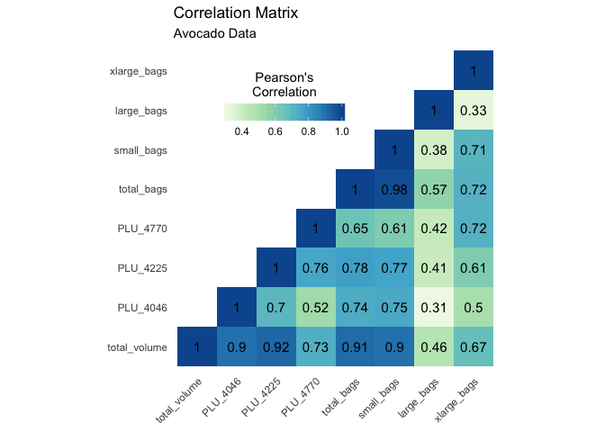

Multicollinearity Analysis
================
Katie Birchard

``` r
library(tidyverse)
library(lubridate)
library(caret)
library(feather)
library(reshape2)
library(kableExtra)
library(car)
source(here::here("src/multicoll/support_functions.R"))

# Set significant figures
options(digits = 4)
```

## Correlation Matrix

Get training data.

``` r
# See README for how to create feather files.
df <- read_feather(here::here("data/train.feather"))
```

Under the assumption that the data can be modelled linearly after
observing the residual plot, we select the continuous numerical
predictors, compute the correlation matrix and wrangle into a plottable
dataframe (*Ggplot2 : Quick Correlation Matrix Heatmap - R Software and
Data Visualization*, n.d.).

``` r
# Create dataframe for correlation matrix chart
corr_df <- df %>%
  select(total_volume,
         PLU_4046,
         PLU_4225,
         PLU_4770,
         total_bags,
         small_bags,
         large_bags,
         xlarge_bags) %>%
  cor %>%
  upper_tri_na %>%
  melt(na.rm = TRUE) %>%
  mutate(value = round(value, 2))
```

Correlation Matrix Chart

``` r
ggplot(corr_df) +
  geom_tile(aes(Var1, Var2, fill = value)) +
  geom_text(aes(Var1, Var2, label = value), color = "black", size = 4) +
  scale_fill_distiller(palette = "GnBu", direction = 1) +
  labs(title = "Correlation Matrix",
       subtitle = "Avocado Data",
       fill = "Pearson's\nCorrelation") +
  coord_fixed() +
  theme_minimal() +
  theme(axis.text.x = element_text(angle = 45, vjust = 1, hjust = 1),
        axis.title.x = element_blank(),
        axis.title.y = element_blank(),
        panel.grid.major = element_blank(),
        legend.justification = c(1, 0),
        legend.position = c(0.55, 0.7),
        legend.direction = "horizontal") +
  guides(fill = guide_colorbar(barwidth = 7,
                               barheight = 1,
                               title.position = "top",
                               title.hjust = 0.5))
```

<!-- -->

Overall, there is fairly high collinarity between many of the
predictors. This was expected, since they all deal with volume of
avocados sold, be it by PLU code, bag type or total volume.

In particular, `total_bags` and `total_volume` were expected to be
highly correlated to other predictors that were sub-quantities of these
totals.

Due to the high correlation, including all these predictors in a
prediction model would probably lead to overfitting.

## Multicollinearity

Create linear model and comput VIF scores from car (Fox and Weisberg
2019) package.

``` r
lm(average_price ~ total_volume +
                   PLU_4046 +
                   PLU_4225 +
                   PLU_4770 +
                   total_bags +
                   small_bags +
                   large_bags +
                   xlarge_bags, data = df) %>%
  vif() %>%
  enframe() %>%
  rename(Predictor = name, "VIF Score" = value) %>%
  kable() %>%
  kable_styling(full_width = FALSE)
```

<table class="table" style="width: auto !important; margin-left: auto; margin-right: auto;">

<thead>

<tr>

<th style="text-align:left;">

Predictor

</th>

<th style="text-align:right;">

VIF Score

</th>

</tr>

</thead>

<tbody>

<tr>

<td style="text-align:left;">

total\_volume

</td>

<td style="text-align:right;">

3.775e+08

</td>

</tr>

<tr>

<td style="text-align:left;">

PLU\_4046

</td>

<td style="text-align:right;">

6.022e+07

</td>

</tr>

<tr>

<td style="text-align:left;">

PLU\_4225

</td>

<td style="text-align:right;">

5.318e+07

</td>

</tr>

<tr>

<td style="text-align:left;">

PLU\_4770

</td>

<td style="text-align:right;">

1.060e+06

</td>

</tr>

<tr>

<td style="text-align:left;">

total\_bags

</td>

<td style="text-align:right;">

1.251e+13

</td>

</tr>

<tr>

<td style="text-align:left;">

small\_bags

</td>

<td style="text-align:right;">

9.390e+12

</td>

</tr>

<tr>

<td style="text-align:left;">

large\_bags

</td>

<td style="text-align:right;">

6.580e+11

</td>

</tr>

<tr>

<td style="text-align:left;">

xlarge\_bags

</td>

<td style="text-align:right;">

1.323e+10

</td>

</tr>

</tbody>

</table>

This suggests extremely high collinearity for these variables in a
linear model. We’ll be careful about using these features. They are
probably not very good predictors of the average avocado price.

## References

<div id="refs" class="references">

<div id="ref-car">

Fox, John, and Sanford Weisberg. 2019. *An R Companion to Applied
Regression*. Third. Thousand Oaks CA: Sage.
<https://socialsciences.mcmaster.ca/jfox/Books/Companion/>.

</div>

<div id="ref-corr">

*Ggplot2 : Quick Correlation Matrix Heatmap - R Software and Data
Visualization*. n.d. STHTDA.
<http://www.sthda.com/english/wiki/ggplot2-quick-correlation-matrix-heatmap-r-software-and-data-visualization>.

</div>

</div>
